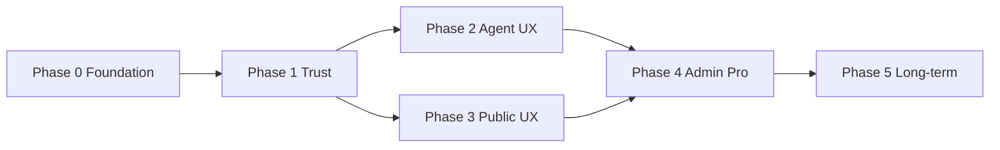

# AI 4 T — Implementation Roadmap

**Purpose:** Executable plan to take AI 4 T from “built in repo” to “trusted daily tool” for pilot clubs (starting with TSV Allach 09), then scale to Pro+ monetization.

**Related docs:**
- Agent architecture: [`AI4TEAM_AGENT_IMPLEMENTATION_PLAN.md`](./AI4TEAM_AGENT_IMPLEMENTATION_PLAN.md)
- Deploy & trials: [`../DEPLOYMENT.md`](../DEPLOYMENT.md) (AI 4 T + Agent sections)
- Operator script (Allach): [`../supabase/scripts/fix_tsv_allach_ai_access.sql`](../supabase/scripts/fix_tsv_allach_ai_access.sql)
- Execution queue: [`../TASKS.md`](../TASKS.md) (`AI-OPS-001`, `AI-AGENT-OPS-001`)

**Principles (do not skip):**
1. **Deploy before features** — prompt/context fixes only affect users after Edge redeploy.
2. **Never invent club data** — if context is missing, say so; cite schedule rows when answering time questions.
3. **Propose → confirm → execute** — no silent LLM writes.
4. **Same RBAC as the UI** — permissions in RPCs, not only in the client.

---

## Overview (phases at a glance)

| Phase | Theme | Duration (estimate) | Exit criteria |
|-------|--------|---------------------|---------------|
| **0** | Foundation | 1–3 days | Allach pilot passes smoke checklist |
| **1** | Trust & accuracy | 1–2 weeks | Golden questions green in CI + manual pilot |
| **2** | Agent daily-use | 2–3 weeks | 3 workflows used weekly by real coaches |
| **3** | UX & positioning | 1–2 weeks | Consistent AI 4 T entry + role prompts |
| **4** | Admin control (Pro+) | 2–3 weeks | Club instructions + usage visible to admin |
| **5** | Long-term | Ongoing | Prioritized from pilot feedback |



---

## Phase 0 — Finish the foundation (DO FIRST)

**Goal:** Staging/production match the repo; TSV Allach can use chat, agent, and public modal without “not configured” / wrong-plan surprises.

### 0.1 Database migrations (Supabase SQL)

Apply in **filename order** on each environment (staging → prod):

| Migration | Purpose |
|-----------|---------|
| `20260614140000_club_feature_trials.sql` | `club_feature_trials`; seeds Allach AI trial |
| `20260624120000_club_public_feature_flags_rpc.sql` | Public `club_public_has_feature` (ai, shop) |
| `20260624180000_club_page_multilingual_feature.sql` | `multilingual` trial + RPC extension |
| `20260615120000_ai_agent_runs.sql` | Agent audit table |
| `20260615130000_ai_agent_tool_rpcs.sql` | Agent write RPCs |
| `20260615140000_ai_agent_runs_conversation_id.sql` | Link runs to conversations |
| `20260615150000_ai_agent_tool_rpcs_extended.sql` | Extended agent tools |

**Allach shortcut:** run [`supabase/scripts/fix_tsv_allach_ai_access.sql`](../supabase/scripts/fix_tsv_allach_ai_access.sql) in SQL Editor (idempotent).

**Verify:**

```sql
select c.name, b.plan_id, b.status, t.feature, t.expires_at
from public.clubs c
left join public.billing_subscriptions b on b.club_id = c.id
left join public.club_feature_trials t on t.club_id = c.id
where c.slug ilike '%allach%';
```

Expect: `ai` trial active **and/or** `pro` + `trialing`; optional `multilingual` trial.

### 0.2 Edge functions & secrets

| Function | Why redeploy |
|----------|----------------|
| `co-trainer` | `ai4team_scope.ts`, local-time schedule prompt, **AI 4 T** identity |
| `ai4team-agent` | Agent propose/execute |
| `co-aimin` | Scope policy parity |
| `ai-match-analysis` | Scope policy parity |

```bash
supabase functions deploy co-trainer
supabase functions deploy ai4team-agent
supabase functions deploy co-aimin
supabase functions deploy ai-match-analysis
```

**Secrets (project settings):** `OPENAI_API_KEY` (or club-level LLM in Settings → Club → AI provider). Confirm **Test connection** succeeds for Allach admin.

**Client:** `.env` has correct `VITE_SUPABASE_URL` / anon key; restart `npm run dev` after env changes.

### 0.3 Smoke test checklist (TSV Allach 09)

Use a **trainer/admin** account and a **member/player** account.

#### Access & gating
- [ ] `/co-trainer` loads (not PlanGate block) for Allach admin/trainer
- [ ] Player sees appropriate limits (chat OK; agent mutations blocked)
- [ ] Public `/club/tsv-allach-09` shows AI 4 T section + hero button when `ai4team` section enabled
- [ ] Public modal opens; signed-in member can chat (if AI feature active)

#### Chat accuracy (manual)
- [ ] “When is U12-1 training?” → time matches Teams UI (**club local**, not UTC)
- [ ] “Who are you?” → **AI 4 T** (not AI4Team / ONE4Team)
- [ ] Off-topic (e.g. “buy shoes online”) → short redirect, club-focused suggestions

#### Agent tab
- [ ] **Agent** tab → pick workflow → **Review & propose** → summary visible
- [ ] **Confirm & run** → status `executed`; row in `ai_agent_runs`
- [ ] Repeat confirm with same idempotency → no duplicate write
- [ ] Header **Sparkles** on Teams → sheet opens with page context

#### Regression
- [ ] Settings → Club → AI provider → Test connection = success
- [ ] Rate limit: rapid sends eventually return friendly message (not opaque 500)

**Sign-off:** Pilot lead (Georg) + one Allach coach. Log issues in GitHub with label `ai4t-pilot`.

---

## Phase 1 — Trust & accuracy (highest ROI)

**Goal:** Coaches trust answers about *their* club. Measure with a fixed question set before/after each deploy.

### 1.1 Golden-question test set

**Deliverables:**
- File: `src/lib/ai-context.test.ts` + `src/lib/ai-context-golden.ts` — **context builder unit tests** (no LLM call): given fixture rows, schedule lines contain expected local times and team names.
- File: `docs/AI4T_GOLDEN_QUESTIONS.md` — manual E2E script for pilot (10–15 questions).
- Optional: nightly job or `npm run test:ai4t-golden` that runs context tests in CI.

**Seed questions (Allach):**

| ID | Question | Pass criteria |
|----|----------|---------------|
| GQ-01 | When is U12-1 training? | Correct weekday + **18:00** (or actual local time) |
| GQ-02 | What trainings are this week? | List matches schedule module |
| GQ-03 | Next match for [team]? | Correct opponent/date or “none listed” |
| GQ-04 | How many active members? | Matches dashboard count or “not in context” |
| GQ-05 | Who are you? | **AI 4 T** branding |

**Code touchpoints:**
- `src/lib/ai-context.ts` — extend sections (attendance, matches, venues)
- `src/lib/ai-context.test.ts` — extend UTC→Berlin cases
- `supabase/functions/_shared/ai4team_scope.ts` — “cite context; don’t invent times”

### 1.2 “Source” in answers (lightweight v1)

**Approach A (prompt-only, fast):** Add to `buildCoTrainerSystemPrompt`: “When stating a time or fact from context, prefix with a short source line, e.g. `From schedule (Tue): 18:00–19:30`.”

**Approach B (structured, better):** Post-process or tool-call: model returns `citations: [{ section: "schedule", line: "..." }]`; UI renders footnotes in `CoTrainer.tsx` / `Ai4tEmbedChat.tsx`.

**Tasks:**
- [ ] 1.2a Prompt citation rule in `ai4team_scope.ts`
- [ ] 1.2b Optional UI footnote component in chat bubbles
- [ ] 1.2c Manual check: GQ-01 answer includes schedule reference

### 1.3 Wrong-answer feedback

**Schema (new migration):**

```sql
-- ai_message_feedback: thumbs + optional note
create table public.ai_message_feedback (
  id uuid primary key default gen_random_uuid(),
  club_id uuid not null references public.clubs(id) on delete cascade,
  user_id uuid not null references auth.users(id) on delete cascade,
  conversation_id uuid references public.ai_conversations(id) on delete set null,
  message_id text,           -- client-side id or server turn id
  rating smallint not null check (rating in (-1, 1)),
  note text,
  context_snapshot jsonb,    -- optional: redacted club context hash
  created_at timestamptz not null default now()
);
```

**UI:** Thumbs up/down on assistant messages in `CoTrainer.tsx` + public `Ai4tEmbedChat.tsx`.

**Ops:** Weekly review of `rating = -1` for Allach; feed into prompt/context fixes.

### 1.4 Richer club context

Add to `buildClubContext()` **only when data exists** (never fabricate):

| Data | Source tables | Consumer |
|------|---------------|----------|
| Next match per team | `matches` + `teams` | Pre-match questions |
| Last 3 results | `matches` | Form / morale |
| Attendance trend (14d) | `training_attendance` / activities | “Who’s been absent?” |
| Venue / access notes | `clubs.public_location_notes`, team fields | Parent questions |
| Featured team hint | `featured_team_ids` in page config | Home context |

**Tasks:**
- [ ] 1.4a Audit which tables Allach actually populates
- [ ] 1.4b Implement sections incrementally + unit tests per section
- [ ] 1.4c Update golden tests

### 1.5 DE-first copy for German clubs

**Tasks:**
- [ ] Detect club `default_language` / user locale in `buildClubContext` → pass `UI language: de` prominently
- [ ] `ai4team_scope.ts`: “Reply in German when club or user language is de”
- [ ] i18n: suggested prompts in `src/i18n/de.ts` under `coTrainer` / `ai4team` — natural coaching German
- [ ] Public embed: welcome string uses visitor `lang` param when club is bilingual

**Acceptance:** Allach coach asks in German; answer is fluent German; brand remains **AI 4 T**.

---

## Phase 2 — Agent workflows (daily-useful)

**Goal:** Coaches complete real tasks from Teams/Members without opening a separate “AI app”.

### 2.1 Surface existing intents on Teams page

**Already in repo:** `AiAgentHeaderButton`, `useRegisterAiAgentContext` on `Teams.tsx`.

**Tasks:**
- [ ] 2.1a Add visible quick actions (not only header Sparkles): e.g. chips “Plan this week”, “Cancel session”, “Notify co-trainers”
- [ ] 2.1b Wire `page_context` with `team_id`, selected week, visible sessions
- [ ] 2.1c i18n labels DE/EN

**Files:** `src/pages/Teams.tsx`, `src/lib/ai-agent/intents.ts`, `src/components/ai-agent/AiAgentSheet.tsx`

### 2.2 New high-value intents (prioritized)

| Intent | Priority | Depends on |
|--------|----------|------------|
| Duplicate last week’s plan | P1 | `agent_plan_week` patterns |
| Reschedule series (move all Tuesday → Thursday) | P2 | New RPC + proposal UI |
| Pre-match brief | P1 | Phase 1.4 match context |
| Post-match summary draft | P2 | Match result + optional notes |

**Per intent workflow:**
1. RPC in new migration (security definer + role checks)
2. Tool handler in `ai4team_agent_tools.ts`
3. Template in `src/lib/ai-agent/intents.ts`
4. Proposal preview rows in `AiAgentWorkspace`
5. Manual smoke + audit row in `ai_agent_runs`

### 2.3 Clear outcomes after execute

**Tasks:**
- [ ] `ExecuteResponse.result.links[]` always populated when a record was created (href to `/teams`, `/members`, `/communication`)
- [ ] Toast + inline success card in `AiAgentWorkspace` with primary link
- [ ] History tab shows clickable outcomes

### 2.4 Player-safe mode

**Already aligned:** mutations require trainer/admin in RPCs.

**Tasks:**
- [ ] Hide Agent tab / Sparkles for `player` role (or show read-only “Ask AI 4 T” without workflows)
- [ ] Document in help FAQ
- [ ] E2E: player cannot call `execute` successfully via API

---

## Phase 3 — UX & positioning

### 3.1 Same entry everywhere (public)

**Tasks:**
- [ ] Audit: hero CTA, section card, modal — same wordmark button, same modal component (`public-club-ai4t-modal.tsx`)
- [ ] Shared props: club branding, `openAi4tModal`, language param
- [ ] Visual QA checklist on mobile + desktop

### 3.2 Role-based welcome (dashboard)

**Tasks:**
- [ ] `CoTrainer.tsx`: welcome + example prompts from role (`admin` | `trainer` | `player`)
- [ ] Pull prompt list from `src/lib/ai-4-t-role-prompts.ts` (extend file)
- [ ] DE/EN variants

### 3.3 Contextual empty states

**Tasks:**
- [ ] When opened from Teams with `team_id`: “Ask about [Team name] schedule, roster, or next match”
- [ ] Pass through `?prompt=` and `page_context` from deep links

### 3.4 Voice on mobile

**Already in repo:** `use-ai4team-voice`, `Ai4TeamVoiceControls`.

**Tasks:**
- [ ] Show voice controls prominently on `sm` breakpoints in chat
- [ ] Pitch-side copy in i18n (“Hands-free at training”)
- [ ] Fallback message when browser lacks Speech API

---

## Phase 4 — Club admin control (Pro+ depth)

### 4.1 Club AI instructions

**Schema:** extend `club_llm_settings` or new `club_ai_instructions text` + `club_ai_tone` jsonb.

**UI:** Settings → Club → AI 4 T → “Instructions for your club” (admin only).

**Runtime:** Append to system prompt in `co-trainer` and `ai4team-agent` after `buildClubContext`.

### 4.2 Usage dashboard

**Metrics (admin-only page or Settings tab):**
- Messages per month (from `ai_conversations` / message logs)
- Agent runs by intent + success rate (`ai_agent_runs`)
- Top users (anonymized option for GDPR)

**Implementation:** RPC `get_club_ai_usage_stats(club_id, from, to)` — security definer + `is_club_admin`.

### 4.3 Optional caps

- Soft limit per club/month (plan tier)
- Per-role daily cap (e.g. players 20/day)
- Enforce in `enforceLlmRateLimitOrResponse` shared module

**Tie to pricing:** document in `plan-limits.ts` + Pricing page FAQ.

---

## Phase 5 — Long-term (after pilot confidence)

**Gate:** Start Phase 5 only when all [pilot success metrics](./AI4T_PILOT_SUCCESS_METRICS.md) pass (tracked as **AI4T-PILOT-001**–**005** in [`TASKS.md`](../TASKS.md)). Until then, collect feedback and fix regressions from Phases 0–4.

Prioritize from Allach feedback; suggested order:

1. **Multi-language answers** — align with public club EN/DE (`supported_languages`, visitor `lang`)
2. **Document-aware Q&A** — RAG over public docs + permission-gated internal docs
3. **Match-day mode** — live score in context + halftime talking points
4. **Announcement delivery** — agent proposes → Communication sends (email/WhatsApp when integrated)

---

## Suggested timeline (TSV Allach pilot)

| Week | Focus | Milestone |
|------|--------|-----------|
| **W1** | Phase 0 complete | Smoke checklist signed off |
| **W2** | Phase 1.1 + 1.2 + 1.5 | Golden tests in CI; German replies; citation prompt |
| **W3** | Phase 1.3 + 1.4 (partial) | Feedback widget; match + attendance in context |
| **W4** | Phase 2.1 + 2.3 | Teams quick actions; outcome links |
| **W5–6** | Phase 2.2 (P1 intents) | Duplicate week + pre-match brief |
| **W7** | Phase 3 | Public + dashboard UX polish |
| **W8+** | Phase 4 | Admin instructions + usage (Pro story) |

---

## RACI (lightweight)

| Area | Responsible | Accountable |
|------|-------------|-------------|
| Migrations & Edge deploy | Operator / dev | Georg |
| Golden questions & pilot feedback | Allach coach + Georg | Georg |
| Agent RPCs & security | Dev | Dev + review |
| i18n DE copy | Dev + native speaker | Club contact |
| Pricing / plan gates | Product | Georg |

---

## Task IDs in `TASKS.md`

Tracked under **AI 4 T roadmap — pilot execution** in [`TASKS.md`](../TASKS.md):

| ID | Phase | Summary |
|----|-------|---------|
| AI4T-P0-001 | 0 | Apply migrations + deploy Edge (checklist) |
| AI4T-P0-002 | 0 | Allach smoke sign-off |
| AI4T-P1-001 | 1 | Golden context tests + `AI4T_GOLDEN_QUESTIONS.md` |
| AI4T-P1-002 | 1 | Citation prompt + optional UI |
| AI4T-P1-003 | 1 | `ai_message_feedback` migration + UI |
| AI4T-P1-004 | 1 | Richer `ai-context` sections |
| AI4T-P1-005 | 1 | DE-first replies |
| AI4T-P2-001 | 2 | Teams quick-action chips |
| AI4T-P2-002 | 2 | Outcome links after execute |
| AI4T-P2-003 | 2 | New intent: duplicate week |
| AI4T-P3-001 | 3 | Role-based welcome prompts |
| AI4T-P4-001 | 4 | Club AI instructions + usage RPC |
| AI4T-PILOT-001 … 005 | Gate | 8-week pilot success → Phase 5 entry |

Phase 0 issue template: [`.github/ISSUE_TEMPLATE/ai4t-phase-0-smoke.md`](../.github/ISSUE_TEMPLATE/ai4t-phase-0-smoke.md)

Monthly pilot review: [`.github/ISSUE_TEMPLATE/ai4t-pilot-monthly-review.md`](../.github/ISSUE_TEMPLATE/ai4t-pilot-monthly-review.md) · Metrics guide: [`AI4T_PILOT_SUCCESS_METRICS.md`](./AI4T_PILOT_SUCCESS_METRICS.md)

---

## Definition of done (pilot success)

After **8 weeks**, TSV Allach is a success if **all five** metrics pass. Full measurement guide: [`AI4T_PILOT_SUCCESS_METRICS.md`](./AI4T_PILOT_SUCCESS_METRICS.md). Tracked in [`TASKS.md`](../TASKS.md) as **AI4T-PILOT-001**–**005**.

| ID | Metric | Target |
|----|--------|--------|
| PILOT-001 | Weekly coach usage | ≥3 coaches (trainer/admin), chat ≥1×/week, **4 consecutive weeks** |
| PILOT-002 | Golden questions | **≥90%** pass on monthly manual run |
| PILOT-003 | Safe agent runs | **≥10** executed; **zero** data incidents |
| PILOT-004 | Thumbs-down rate | **&lt;15%** of rated messages; trending down |
| PILOT-005 | Qualitative | ≥1 coach: “I use it for training planning” |

**Phase 5 go/no-go:** All five green → prioritize Phase 5 backlog; any red → fix or descope before new features.

---

*Last updated: 2026-06-24. Phase 0 signed off; pilot gate active.*
