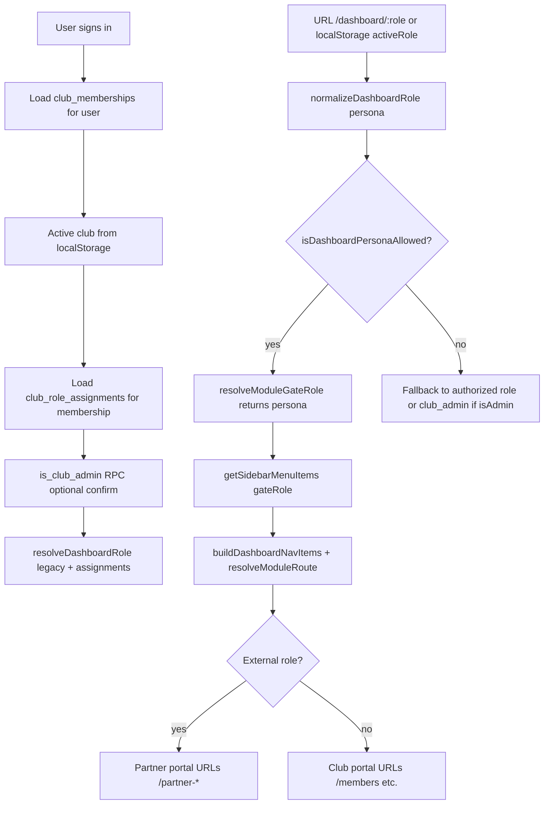

# ONE4Team — AI investigation brief: roles, portals, marketplace & AI 4 T

**Purpose:** Copy this document (or the **Investigation prompt** section below) into ChatGPT, Claude, or another AI to evaluate role management, club vs partner UX, and platform architecture.  
**Codebase:** `ONE4Team_v2` — Vite + React + TypeScript SPA, Supabase (Postgres RLS, Auth, Storage, Edge Functions).  
**Last aligned with repo:** 2026-07-01 (persona data scoping player/member for messages/tasks, public Live Scores UI, partner portal, Partner Page, marketplace provider portal, AI 4 T partner persona).

---

## Investigation prompt (copy from here)

```
You are reviewing ONE4Team, a multi-tenant SaaS for sports clubs and their external partners (suppliers, sponsors, service providers, consultants). Your task is to evaluate how roles are defined, enforced, and presented in the UI — and how clubs and partners interact on the platform.

## Product concept

ONE4Team has TWO parallel worlds:

1. **Club world (internal operations)** — Members, teams, trainings, matches, events, finances, club communication, tasks, public club microsite (`/club/:slug`), club procurement via Marketplace, and partnership CRM via Partners.

2. **Partner world (external providers)** — Marketplace listings, Partner Page (public supplier profile at `/supplier/:slug`), partner-scoped messages/tasks/reports, and AI 4 T at `/partner-ai`. Partners discover and serve clubs; they do NOT manage other suppliers or club-internal data.

A single human may hold **both** a club membership (e.g. admin at TSV Allach) and a marketplace provider profile (e.g. supplier). The app uses **dashboard personas** (UI mode) separate from **database authorization** (what they are allowed to do).

## Technology & enforcement layers

| Layer | Responsibility |
|-------|----------------|
| **Postgres `app_role` enum** | Legacy primary role on `club_memberships.role` |
| **`club_role_assignments`** | Scoped RBAC: `role_kind` + `scope` (club \| team \| self) + optional `scope_team_id` |
| **`src/lib/rbac-config.ts`** | Single source of truth: roles × dashboard modules × access levels |
| **`src/lib/permissions.ts`** | Bridges matrix → legacy permission strings for `usePermissions()` |
| **`src/lib/dashboard-persona.ts`** | Validates URL/localStorage persona vs authorized roles |
| **`useModuleGateRole()`** | Effective role for sidebar, `RequireModule` route guards, data scope |
| **`PersonaPortalGate`** | Redirects club users away from `/partner-*` and partners away from club-only routes |
| **Supabase RLS** | Row-level security per table (memberships, marketplace, messages, etc.) |
| **Edge Functions** | AI 4 T (`co-trainer`, `ai4team-agent`) with club scope + plan/trial gates |

## Role taxonomy

### Internal club roles (`INTERNAL_CLUB_ROLES`)
| Product label | `DashboardRole` | Typical DB / assignment |
|---------------|-----------------|-------------------------|
| Club Admin | `club_admin` | `club_memberships.role = admin` and/or `club_role_assignments.role_kind = club_admin` |
| Trainer | `trainer` | `trainer`, `team_admin` assignment |
| Team Staff | `team_staff` | `staff` |
| Player | `player` | `player`, `player_teen`, `player_adult` |
| Parent / Supporter | `parent_supporter` | `parent` |
| Member | `member` | `member` |

### External partner roles (`EXTERNAL_ROLES`)
| Product label | `DashboardRole` | Identity |
|---------------|-----------------|----------|
| Sponsor | `sponsor` | Marketplace `provider_type` + optional club assignment |
| Supplier | `supplier` | Marketplace provider profile owner |
| Service Provider | `service_provider` | Same |
| Consultant | `consultant` | Same |

`normalizeDashboardRole()` maps aliases (e.g. `admin` → `club_admin`, `parent` → `parent_supporter`). Unknown roles → lowest privilege, never admin.

## Dashboard modules (private app)

Modules map to sidebar items and routes: `dashboard`, `assets`, `members`, `trainings`, `matches`, `events`, `reports`, `payments`, `messages`, `tasks`, `marketplace`, `partners`, `ai4t`, `club_page`, `supplier_page`, `club_shop`, `settings`, `support`.

**Access levels per module:** `none` | `read` | `limited` | `own` | `assigned` | `team` | `full` — drive menu visibility, route guards, and data-scope hints (`club`, `team`, `own`, `partner`, etc.).

**Sidebar profiles** (`SIDEBAR_MENU_PROFILES`) define menu order per role, then filter by `canAccessModule()`.

Notable rules:
- **Club Admin** sees full club menu (members, payments, assets, club_page, marketplace, partners, …) but **NOT** `supplier_page` (Partner Page) — that is external-only.
- **External roles** see: dashboard, marketplace, messages, tasks, reports, ai4t, supplier_page (Partner Page), settings, support — no trainings/matches/members.
- **Trainer / player / parent** see sports-focused subsets; no marketplace or partners (procurement is admin-only).

## Dual-world URL routing

| Concern | Club portal | Partner portal |
|---------|-------------|----------------|
| Marketplace | `/marketplace` | `/partner-marketplace` |
| Messages | `/communication` | `/partner-messages` |
| Tasks | `/tasks` | `/partner-tasks` |
| Reports | `/reports` | `/partner-reports` |
| AI 4 T | `/co-trainer` | `/partner-ai` |
| Public page admin | `/club-page-admin` | `/supplier-page` (UI label: **Partner Page**) |
| Dashboard home | `/dashboard/:persona` | `/dashboard/supplier` (etc.) |

`resolveModuleRoute()` picks the correct URL based on `gateRole`. `ClubOnlyRoute` / `PartnerOnlyRoute` block cross-portal access.

## Persona vs authorization (critical for dual-role users)

- **`club_memberships`** + **`club_role_assignments`** + RPC `is_club_admin` → what user **may** do (authorization).
- **`localStorage one4team.activeRole`** + URL `/dashboard/:role` → which **skin/menu** they view (persona).
- **Settings → Partner role / Switch active dashboard role** calls `switchDashboardPersona()`: sets persona, aligns active club for internal roles, navigates to correct portal home.

Admin users can **preview** trainer/player dashboards without changing DB role. External persona wins for partner routes when allowed.

## How clubs manage their views

1. **Private dashboard** — Role-based sidebar via RBAC; club admin gets KPIs, finances, members, schedule, AI digest.
2. **Club Page Admin** (`/club-page-admin`) — Draft/publish public microsite: branding, sections, hero, schedule/matches/events visibility, join flow, documents, shop, multilingual (feature-gated).
3. **Public club site** (`/club/:slug/*`) — Separate from dashboard RBAC; anonymous/member RSVP, messages hub, tournament boards; controlled by publish flags + `public_page_sections`.
4. **Marketplace (club side)** — Club admins create procurement **requests**, discover providers, receive **offers**, save providers; tabs: Overview, Discover, Requests, Offers, Providers, Reviews, Moderation.
5. **Partners (CRM)** — Active relationships after marketplace or manual entry: contracts, invoices, `partner_tasks`, engagements — club admin only.
6. **AI 4 T (club)** — `/co-trainer`: chat + **Agent** tab with propose→confirm workflows (create/cancel training, plan week, member drafts, announcements); club-scoped context from `buildClubContext()`; fair-use scope guard.

## How partners manage their views

1. **Partner dashboard** — External role sidebar; KPI cards for marketplace/collaboration.
2. **Partner Page** (`/supplier-page`) — Edit public listing (basics, branding, services, contact, publish); live preview; logo/cover upload to `images-marketplace-providers` bucket; public URL `/supplier/:slug`.
3. **Marketplace (provider side)** — `marketplace_provider_profiles` owned by `owner_user_id`; tabs: Overview, My listing, Services, Club requests, Offers sent, Reviews, Settings.
4. **Partner collaboration** — `/partner-messages` (threads with clubs), `/partner-tasks` (assignments from clubs), `/partner-reports` (engagement/revenue summaries).
5. **AI 4 T (partner)** — `/partner-ai`: **Partner Agent** workspace — listing copy, marketplace outreach, club messages, task updates — **no** club training/calendar workflows.

## How clubs and partners meet on the platform

```
[Provider registers] → marketplace_provider_profiles (draft → submitted → active)
        ↓
[Club admin discovers] → Marketplace Discover / Saved providers
        ↓
[Club creates request] → marketplace_requests (category, budget, deadline, visibility)
        ↓
[Provider sends offer] → marketplace_offers (proposal, pricing, status)
        ↓
[Club accepts] → marketplace_partners_bridge → partners row + optional partner_contracts
        ↓
[Ongoing CRM] → /partners (contracts, invoices, partner_tasks) + /partner-messages + /partner-tasks
```

**Marketplace** = discovery & pre-contract. **Partners** = active relationship operations. Winning offers graduate to Partners; not the reverse.

Provider types share one portal shell; copy differs (sponsor packages vs supplier products vs consulting expertise). 20 marketplace categories (teamwear, equipment, catering, IT, consulting, …).

## AI 4 T as innovation layer

| Audience | Route | Capabilities |
|----------|-------|--------------|
| Club admin/trainer | `/co-trainer` | Club ops chat; Agent workflows with confirmation; voice; team-scoped training RBAC |
| Club members (public) | Club modal embed | Chat, limited Agent, guide — scoped to club |
| Partners | `/partner-ai` | Listing/marketplace/collaboration prompts; portal shortcuts; no club mutations |

Gated by: subscription plan, `club_feature_trials`, `club_llm_settings` (per-club API keys optional), `ai4team_scope.ts` (club-only fair use on Edge).

## Data model (key tables)

- `clubs`, `club_memberships`, `club_role_assignments`
- `profiles` (user display)
- `marketplace_provider_profiles`, `marketplace_requests`, `marketplace_offers`, `marketplace_saved_providers`
- `partners`, `partner_contracts`, `partner_invoices`, `partner_tasks`, `partner_task_engagements`
- `club_tasks`, `messages`, `announcements`
- `ai_conversations`, `ai_agent_runs`
- Public club: `clubs.public_page_*`, events, matches, activities, etc.

## Known gaps / investigation targets

Please evaluate and comment on:

1. **Persona vs RLS alignment** — Does switching persona always match Postgres policies for dual-role users?
2. **Marketplace → Partners bridge** — Is accept-offer → CRM flow complete and auditable?
3. **Route guard coverage** — `RequireModule` vs legacy `RequireTrainer`/`RequireAdmin` remnants.
4. **External role club memberships** — Users with `supplier` on `club_memberships` vs pure marketplace profile owners.
5. **AI scope boundaries** — Club Agent intents vs partner Agent; leakage risk across portals.
6. **Public vs private data** — Marketplace listing visibility vs club internal roster/finance isolation.
7. **Scalability** — Multi-club users, active club selection, persona switch UX.
8. **Compliance** — GDPR, commercial data between clubs and suppliers on shared platform.

## Key source files (for code-aware review)

- `src/lib/rbac-config.ts` — matrix, sidebar profiles, module routes
- `src/lib/partner-portal-routes.ts` — dual-world URLs
- `src/lib/dashboard-persona.ts`, `src/lib/switch-dashboard-persona.ts`
- `src/hooks/use-module-gate-role.ts`, `src/hooks/use-permissions.ts`, `src/hooks/use-active-club.ts`
- `src/components/routing/PersonaPortalGate.tsx`
- `src/components/auth/require-module.tsx`
- `src/lib/marketplace-access.ts`, `src/hooks/use-marketplace.ts`
- `src/pages/CoTrainer.tsx`, `src/components/ai-agent/PartnerAiAgentWorkspace.tsx`
- `src/pages/supplier/SupplierPageAdmin.tsx`, `src/pages/club-page-admin/*`
- `docs/rbac-dashboard-plan.md`, `docs/marketplace-implementation-plan.md`, `docs/marketplace-product-structure.md`

## Questions I want answered

1. Is the two-layer model (authorization vs persona) sound for dual-role users? What edge cases break?
2. Are role/module boundaries correct for GDPR and commercial confidentiality between clubs?
3. What security holes exist if a user manipulates `localStorage one4team.activeRole` or URL?
4. How would you simplify or harden the marketplace ↔ partners ↔ collaboration flow?
5. What should AI 4 T do per role without overstepping — recommend a capability matrix.
6. Compare this model to best practices in B2B marketplaces (club procurement + vendor portal).

Respond with: executive summary, role matrix critique, flow diagrams (mermaid), prioritized risks, and concrete recommendations.
```

---

## Extended reference (for humans and deep dives)

### 1. Application structure

```
┌─────────────────────────────────────────────────────────────────────────┐
│                         ONE4Team platform                                │
├──────────────────────────────┬──────────────────────────────────────────┤
│ CLUB WORLD                   │ PARTNER WORLD                             │
│ (internal operations)        │ (external providers)                      │
├──────────────────────────────┼──────────────────────────────────────────┤
│ /dashboard/:persona          │ /dashboard/supplier|sponsor|…           │
│ /members, /teams, /matches   │ /partner-marketplace                      │
│ /payments, /reports          │ /partner-messages, /partner-tasks         │
│ /communication, /tasks       │ /partner-reports                          │
│ /marketplace (procurement)   │ /supplier-page (Partner Page admin)       │
│ /partners (CRM)              │ /partner-ai                               │
│ /club-page-admin             │ Public: /supplier/:slug                   │
│ /co-trainer (AI 4 T)         │                                           │
│ Public: /club/:slug/*        │                                           │
└──────────────────────────────┴──────────────────────────────────────────┘
                              │
                    Shared: Auth (Supabase), Settings, Support,
                    Marketplace DB tables, messaging infrastructure
```

### 2. Role resolution flow



### 3. Module access snapshot (simplified)

| Module | club_admin | trainer | player | supplier |
|--------|:----------:|:-------:|:------:|:--------:|
| members | full | team | own | none |
| trainings | full | team | own | none |
| marketplace | full | none | none | own |
| partners | full | none | none | none |
| supplier_page | **none** | none | none | own |
| ai4t | full | team | limited | limited |
| club_page | full | none | none | none |

Full matrix: `src/lib/rbac-config.ts` → `RBAC_MATRIX`.

### 4. Marketplace ↔ Partners lifecycle

| Stage | Actor | Surface | Data |
|-------|-------|---------|------|
| List | Provider | Partner Page + marketplace profile | `marketplace_provider_profiles` |
| Discover | Club admin | `/marketplace` Discover | saved providers, search |
| Request | Club admin | `/marketplace` Requests | `marketplace_requests` |
| Offer | Provider | `/partner-marketplace` Offers | `marketplace_offers` |
| Accept | Club admin | Offers inbox → bridge | `partners`, `partner_contracts` |
| Operate | Both | `/partners` + `/partner-*` | invoices, tasks, messages |

### 5. AI 4 T surfaces

| Surface | Roles | Club mutations? | Partner focus? |
|---------|-------|-----------------|----------------|
| `/co-trainer` Chat | Club roles | No (advisory) | No |
| `/co-trainer` Agent | admin, trainer | Yes (confirmed) | No |
| `/partner-ai` Agent | External | No | Yes (drafts, links) |
| Public club modal | Member/guest | No | No |

### 6. Club public microsite (out of dashboard RBAC)

Public routes under `/club/:slug` use publish flags and section config — **not** the private `rbac-config` matrix. A visitor may see matches/events without dashboard access. Members may RSVP and use Messages hub when authenticated.

### 7. Multi-club users

- `useActiveClub()` — multiple `club_memberships`; `one4team.activeClubId:{userId}` selects context.
- Permissions and RLS are **per active club**.
- Persona switch may call `setActiveClubId()` to pick admin-capable club when switching to `club_admin`.

### 8. Documentation index in repo

| Document | Content |
|----------|---------|
| `docs/rbac-dashboard-plan.md` | RBAC audit, marketplace §10, checklist |
| `docs/rbac-dashboard-audit.md` | Detailed role/module audit |
| `docs/marketplace-implementation-plan.md` | Phased marketplace build |
| `docs/marketplace-product-structure.md` | IA, tabs, categories |
| `docs/AI4TEAM_AGENT_IMPLEMENTATION_PLAN.md` | Club Agent workflows |
| `docs/AI4T_ROADMAP.md` | Pilot phases |
| `MEMORY_BANK.md` | Handoff context |
| `TASKS.md` | PARTNER-*, AI4T-*, operator apply steps |

### 9. Suggested follow-up prompts for the AI

- *"Draw a sequence diagram for a supplier accepting a club task from marketplace request to partner_tasks completion."*
- *"List every place `gateRole` is read and whether it can diverge from RLS."*
- *"Propose a unified permission model that merges persona and authorization without breaking admin preview mode."*
- *"Audit GDPR: what partner sees of club member PII at each marketplace stage?"*
- *"Benchmark sidebar module set against SportMember, CoachBetter, and generic B2B marketplaces."*

---

## Version note

When the codebase changes, update the **Investigation prompt** section and `Last aligned with repo` date. Key recent changes (2026-07-01): persona-gated messages/tasks (player team-scoped, member club-wide), public Live Scores home UI parity with Reports, partner portal routes, Partner Page admin, partner AI Agent, `supplier_page` hidden for club_admin, `switch-dashboard-persona.ts`.
