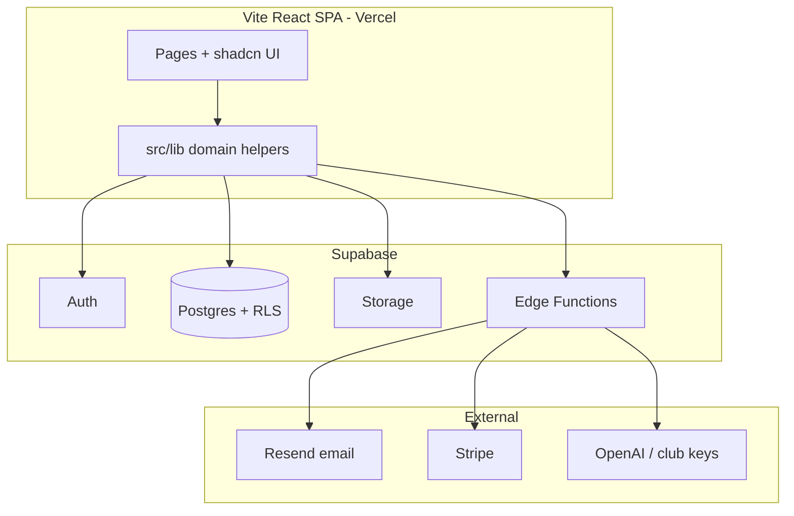

# ONE4Team — Comprehensive project audit

**Audit date:** 2026-07-18 (re-score: Operator CC health, AI fair-use caps, billing recovery, marketplace + digests + guided setup; prior: 2026-07-08 Operator Control Center financials/Recharts)  
**Scope:** Codebase, architecture, UX/design, production readiness, competitive positioning, market value, and value-growth levers  
**Primary reference (existing):** [`ops/PRODUCTION_READINESS_ARTIFACTS.md`](../ops/PRODUCTION_READINESS_ARTIFACTS.md) — strict production-readiness review with risk register, readiness scores, and remediation sprints  

**Related docs:** [`PROJECT_STATUS.md`](../PROJECT_STATUS.md) · [`MEMORY_BANK.md`](../MEMORY_BANK.md) · [`ROADMAP.md`](../ROADMAP.md) · [`docs/PRODUCTION_RELEASE_CHECKLIST.md`](PRODUCTION_RELEASE_CHECKLIST.md) · [`DEPLOYMENT.md`](../DEPLOYMENT.md)

---

## 1. Executive summary

ONE4Team is a **mature-in-code, early-in-market** multi-tenant club management SaaS: Vite + React + TypeScript SPA on Supabase (Postgres RLS, Auth, Storage, Edge Functions), deployed via Vercel. The product spans **internal club ops** (members, teams, schedule, matches, finances, communication, tasks), **external club presence** (configurable public microsites, join flows, tournaments, RSVP, optional PWA), **partner/supplier portal** (marketplace listings, engagement reviews, Partner Page), and an **Operator Control Center** for platform health, catalog, and audit.

| Dimension | Assessment | Prior | **Now** |
|-----------|------------|:-----:|:-------:|
| **Feature breadth** | Above typical regional club apps; AI agent + public site builder + marketplace + digests | 82 | **87** |
| **Code & architecture** | Strong foundations; Members feature modules started but god pages still large | 68 | **69** |
| **UX & design** | Distinctive glass UI; Guided setup; Support FAQ refreshed; DE market fit | 74 | **78** |
| **Production readiness** | Conditionally ready for controlled multi-club rollout (ops audit **68** overall) | 61 | **68** |
| **Test & quality gates** | ~106 unit test files; 8 e2e specs; CI guardrails + bundle budget | 62 | **73** |
| **Commercial readiness** | Billing portal + past_due recovery; plan catalog; marketplace monetization path | 55 | **62** |

**Bottom line:** Credible for **pilot expansion and controlled production**, with clearer billing recovery and AI cost containment than mid-July. Still **not** optimized for unmanaged scale (10k+ concurrent, full SRE observability, native mobile). Strategic value remains **German amateur-sports depth + AI-assisted ops + club-branded public web + marketplace**.

---

## 2. Existing audit artifacts (use these first)

| Document | Purpose |
|----------|---------|
| **[`ops/PRODUCTION_READINESS_ARTIFACTS.md`](../ops/PRODUCTION_READINESS_ARTIFACTS.md)** | **Main technical audit** — risk register (R1–R12), readiness scores, hotspot tables, sprint remediation plan |
| [`ops/SECTION_M_GO_LIVE_CHECKLIST.md`](../ops/SECTION_M_GO_LIVE_CHECKLIST.md) | Go-live evidence rows |
| [`ops/PHASE_B_SECRETS_CHECKLIST.md`](../ops/PHASE_B_SECRETS_CHECKLIST.md) | Client vs Edge secrets |
| [`docs/PRODUCTION_RELEASE_CHECKLIST.md`](PRODUCTION_RELEASE_CHECKLIST.md) | Vercel + Supabase + Resend release steps |
| [`HOLD.md`](../HOLD.md) → **Resend domain verification** | Deferred deploy follow-up: verify domain before automatic invite emails |
| [`TASKS.md`](../TASKS.md) → **DEPLOY-EMAIL-001** | Operator checkbox for Resend + invite email smoke before go-live |
| [`PHASE0_RBAC_CHECKLIST.md`](../PHASE0_RBAC_CHECKLIST.md) | RBAC baseline |
| [`COMPLIANCE_PRIVACY_BY_DESIGN_CHECKLIST.md`](../COMPLIANCE_PRIVACY_BY_DESIGN_CHECKLIST.md) | Privacy/cookie compliance |
| [`ops/MONTHLY_COST_PERF_REVIEW.md`](../ops/MONTHLY_COST_PERF_REVIEW.md) | Cost/perf review template |
| [`docs/TSV_ALLACH_CLUB_PAGE_CHECKLIST.md`](TSV_ALLACH_CLUB_PAGE_CHECKLIST.md) | Pilot club operator checklist |

This document **extends** the ops audit with product, UX, competitive, and valuation lenses. For deployment blockers, follow **PRODUCTION_READINESS_ARTIFACTS** Sections H–M.

---

## 3. Codebase metrics (snapshot)

| Metric | Value (2026-07-18) | Notes |
|--------|------:|-------|
| TypeScript/TSX files (`src/`) | ~745 | Includes operator CC, marketplace, public club, features/members |
| Lines of code (`src/` key surfaces) | i18n EN/DE ~5.8k each; Members ~5.2k | God pages still dominate maintainability risk |
| SQL migrations | ~163 | Includes `20260801*`–`20260803*` operator, digests, marketplace, asset map |
| Edge Functions | **13** active dirs | co-trainer, ai4team-agent, chat-bridge, stripe-*, digests, invite email, health, … |
| Unit/integration test files | **~106** | Heavy on `src/lib/*`; RLS + operator security suites |
| E2E specs | **8** | + marketplace dual-role / RBAC |
| i18n keys file (`en.ts`) | ~5,850 lines | Still a translation monolith |

### Largest files (maintainability hotspots)

| File | ~Lines | Risk |
|------|-------:|------|
| `src/pages/Members.tsx` | **~5,170** | Still a god page (grew since prior audit); `src/features/members/*` panels started |
| `src/i18n/en.ts` / `de.ts` | **~5,850** each | Translation monolith; merge conflict prone |
| `src/pages/Communication.tsx` | **~2,460** | Realtime, attachments, bridge, pagination |
| `src/pages/ClubPageAdmin.tsx` | **~1,780** | Public site CMS complexity |
| `src/pages/Matches.tsx` | **~1,750** | Competitions + tournaments + standings |

**Recommendation:** Finish splitting `Members.tsx` onto `src/features/members/*` routes/panels; colocate i18n by domain before adding more member features.

---

## 4. Code structure & architecture

### Strengths

- **Clear stack:** Vite SPA + Supabase BaaS — fast iteration, no custom backend server to operate.
- **Security model:** RLS-first multi-tenancy; Edge Functions for privileged ops (Stripe, LLM, invite email); `can_review_club_join_requests`, `is_club_admin` RPCs.
- **Shared lib layer:** Domain logic extracted to `src/lib/*` with targeted tests (imports, Sommerfest, attendance, AI agent, public club).
- **Ops maturity:** CI (`guardrails`, `budget:bundle`, `audit:phase0`), k6 load scripts, runbooks under `ops/runbooks/`.
- **Lazy routes:** `App.tsx` code-splits heavy pages; public club routes isolated under `/club/:slug/*`.
- **Plan gating:** `PlanGate`, `club_feature_trials`, Stripe checkout — monetization path exists.

### Weaknesses

- **Page-level god components** — business logic, Supabase calls, and UI intertwined in 2k–5k line files.
- **Client-side role gates** (`RequireAdmin`, `RequireTrainer`) are UX-only; must always rely on RLS (documented in ops audit R2).
- **Inconsistent error UX** — `supabase-error-message.ts` started but not universal; invite flow now has Resend/CORS-specific toasts.
- **Generated types drift** — large `types.ts`; migrations outpace local regen in some envs.
- **Pilot-specific code in core** — TSV Allach/Sommerfest helpers live in `src/lib/tsv-allach-*`; acceptable for pilot, should stay behind feature flags or club slug checks long term.

### Architecture diagram (simplified)

---

## 5. Design & UX audit

### Visual identity

- **Glass / iOS-inspired dashboard** with animated football field — distinctive vs utilitarian competitors (Spond, SportMember).
- **Club theming on public pages** — `club-theme-provider`, hero overlays, accent CTAs; light-brand contrast fixes applied.
- **Consistent component system** — shadcn/Radix, Lucide icons (emoji largely removed from dashboard chrome).
- **Bilingual DE/EN** — strong for DACH market; browser detection + manual toggle.

### UX strengths

- **Role-based dashboard** — admin sees finances/setup; trainer/player see sports widgets (`dashboard-section-visibility.ts`).
- **Public club microsite** — mobile header, team filter (`?team=`), RSVP on schedule/matches, Messages hub (**Open Messages**), embedded Communication with forward-to-WhatsApp, readable composer, **mobile channel dropdown + scrollable chat thread** (2026-07-06), **accurate pagination footer** (2026-07-06), Sommerfest live board with team logos/goals KPI/mobile live bar, **Info** duration popover + **persisted kickoff times** (2026-07-06), mobile hero club logo + pulse (2026-07-05).
- **AI 4 T Agent** — contextual entry from Members/Teams/Activities; propose → confirm → execute reduces admin busywork.
- **Member ops** — Excel/CSV import, draft → invite workflow, club card PNG export, team assignment from members and teams.
- **Cookie consent** — GDPR-oriented preference centre (v2 schema in localStorage); AI 4 T explicitly outside cookie categories (2026-07-07).
- **Legal pages** — Privacy **13** sections incl. **§5 Sub-processors & integrations** and **§11 AI 4 T**; Terms **§14 AI 4 T**; stable **`.legal-panel`** rendering without glass flicker (2026-07-07). Operator still owes full street address + HRB (**LEGAL-OPS-001** / **002**).

### UX gaps & friction

| Area | Issue | Impact |
|------|--------|--------|
| **Members page** | Very dense; many modes (roster, drafts, invites, bulk) in one surface | Steep learning curve for volunteer admins |
| **Invite flow** | Was manual link-only; email now via Resend but requires DNS/domain ops | Operators need clear docs (see production checklist) |
| **Onboarding** | Multi-path (create club, redeem invite, join request) | Good power, needs guided first-run for new clubs |
| **Mobile admin** | Improved scroll/tap targets; some tables still heavy on phone | Trainers often on mobile |
| **Error messages** | Mix of EN technical strings (Edge Function) and DE product copy | Trust erosion when Resend/CORS fail |
| **No native app** | PWA-friendly public site; dashboard is responsive web only | Competitors offer iOS/Android apps |

### UX priority fixes

1. ~~**Wizard for “add first 10 members”**~~ **Shipped (Guided setup)** — welcome → team → import → invite → publish; deepen per-row invite status next.
2. **Settings / Operator health** — Operator Performance now probes Auth/Sentry/DB/Edge; club admins still need a simpler “integrations status” strip.
3. **Empty states** — more guided CTAs on Teams, Communication, Tasks for new clubs.
4. **Split Members UI** — `src/features/members/*` panels exist; finish extracting logic out of `Members.tsx`.

---

## 6. Feature map vs typical club SaaS

| Capability | ONE4Team | Spond / TeamSnap | SportMember (DE) | CoachBetter |
|------------|:--------:|:----------------:|:----------------:|:-----------:|
| Member roster & roles | ✅ Strong | ✅ | ✅ | ◐ |
| Schedule & RSVP | ✅ + team overview | ✅ | ✅ | ✅ |
| Match management | ✅ + AI analysis | ◐ | ✅ | ✅ |
| Payments / dues | ✅ Packages + payment lines (`/payments`); legacy `/dues`; Stripe club billing | ✅ | ✅ | ◐ |
| Club shop | ✅ | ◐ | ◐ | ✗ |
| Public club website | ✅ **Builder** | ◐ | ◐ | ✗ |
| In-app messaging | ✅ + bridge beta | ✅ | ✅ | ◐ |
| AI assistant / agent | ✅ **Differentiator** | ✗ / minimal | ✗ | ◐ |
| Financial P&L report | ✅ | ◐ | ✅ | ✗ |
| German Mitgliederliste import | ✅ **Differentiator** | ✗ | ✅ | ✗ |
| Native mobile app | ✗ (web) | ✅ | ✅ | ✅ |
| Federation integrations (DFB, etc.) | ✗ | ◐ | ◐ | ✅ |

**Positioning:** ONE4Team is closest to **“SportMember + modern UX + public site builder + AI ops layer”** for German amateur football, not a pure messaging app.

---

## 7. Production & security (summary from ops audit)

Scores from [`ops/PRODUCTION_READINESS_ARTIFACTS.md`](../ops/PRODUCTION_READINESS_ARTIFACTS.md) Section B (**2026-07-18 re-score**):

| Area | Prior | **Now** |
|------|------:|--------:|
| Deployment readiness | 64 | **70** |
| Scalability readiness | 58 | **64** |
| Security readiness | 66 | **72** |
| Observability readiness | 48 | **58** |
| Tenant isolation readiness | 74 | **78** |
| **Overall** | **61** | **68** |

### What moved the needle (July 2026 wave)

- **Operator Control Center** — audit trail, usage analytics, **system health probes** (`operator-system-health.ts`)
- **Billing recovery** — `stripe-billing-portal`, `invoice.paid` clears `past_due`, Settings banner
- **AI cost containment** — plan monthly fair-use caps (`ai_usage_caps.ts` + UI meters + value metrics card)
- **Marketplace** — engagement reviews, RBAC tests, dual-role Playwright smoke
- **Automation** — `process-weekly-digests`; join-funnel analytics; WhatsApp Meta `hub.challenge` verify
- **Launch path** — Guided setup; Support & FAQ refresh for new surfaces

### Top open risks (still)

1. **RLS policy drift** across environments — run JWT RLS suite + policy drift script on staging/prod.
2. **Section L observability** — Sentry/Supabase/Stripe dashboards and pager not fully wired (code probes ≠ SRE stack).
3. **Realtime chat at scale** — Communication optimized but unproven at 500+ concurrent.
4. **Resend/domain ops** — invite email depends on verified sending domain.
5. **God components** — Members/Communication still slow developer velocity.

---

## 8. Market value assessment

> **Disclaimer:** Valuations below are **indicative frameworks**, not formal appraisals. Actual value depends on revenue, churn, team, IP ownership, and buyer/strategic context.

### Replacement cost (what it would cost to rebuild)

| Factor | Estimate |
|--------|----------|
| ~84k LOC production TS + 114 migrations + Edge Functions | **12–24 person-months** |
| At €80–120k fully loaded dev cost / year equivalent | **~€250k–€600k** replacement cost |
| Plus design, QA, ops docs, pilot iteration (TSV Allach) | **+€50k–€150k** |

### Commercial value drivers (what increases price)

| Driver | Current state | Value impact |
|--------|---------------|--------------|
| **Paying clubs (ARR)** | Stripe wired; pilot/trial heavy | Primary SaaS multiple (3–8× ARR early stage) |
| **Logo retention** | TSV Allach pilot depth | Reference case for DACH sales |
| **AI 4 T differentiation** | Agent + scope guardrails | Premium tier justification (+€20–50/club/mo) |
| **Public microsite** | Full CMS + join + tournament | Replaces WordPress + separate app |
| **Data moat** | Member master records, attendance, finances | Switching cost once adopted |
| **Technical debt** | Large page files, ops gaps | Discounts valuation 15–30% |

### Illustrative scenarios (not predictions)

| Scenario | Assumption | Indicative platform value |
|----------|------------|---------------------------|
| **Asset sale (pre-revenue)** | Code + docs + pilot, no ARR | **€150k–€400k** to a strategic buyer (software agency, sports federation vendor) |
| **Early SaaS** | 20 clubs × €79/mo ≈ **€19k ARR** | **€60k–€150k** (3–8× ARR) + asset premium |
| **Growth SaaS** | 200 clubs × €99/mo ≈ **€240k ARR** | **€1M–€2.5M** range typical for niche B2B at early growth |
| **Strategic acquisition** | AI + public site + DE member data workflows | Premium vs pure ARR if buyer is SportMember/Spond-class |

### Comparable market context (2025–2026)

- **Spond** — Nordic leader, millions of users; team communication + payments; valued far above early-stage (not direct comp for pre-scale ONE4Team).
- **SportMember** — Established in Denmark/Germany; membership + payments; less AI/public-site focus.
- **TeamSnap / LeagueApps** — US-centric; strong registration and scheduling.
- **CoachBetter** — Coaching content + planning; overlaps on training, not club admin breadth.

ONE4Team wins on **integrated story**: admin dashboard + public club face + AI agent + German registry import in one product.

---

## 9. How to increase platform value (prioritized)

### Tier 1 — Revenue & retention (0–6 months)

| Action | Effort | Value lever |
|--------|--------|-------------|
| **Close production go-live** — Vercel prod, Resend verified domain, full checklist | Low (ops) | Unblocks paid pilots |
| **Convert TSV Allach to paying reference** — case study, testimonial | Low | Sales asset |
| **Pricing page → live Stripe** — Kick-off / Squad / Pro / Champions base+member; Founding Club offer path | Medium | ARR + activation |
| **Founding Club programme** — redeem + expiry job live (`ONE4Team-Founding-Club-12M`) | Low–Medium | Pilot acquisition |
| **Onboarding wizard** — first club, first team, first 5 members | ~~Medium~~ **Done (Guided setup)** | Activation ↑ churn ↓ |
| **Invite email reliability** — monitor Resend bounces, admin delivery status | Low | Trust |
| **AI 4 T outcomes metrics** — value metrics card shipped; deepen pilot KPIs | Medium | Premium tier proof |

### Tier 2 — Product differentiation (6–12 months)

| Action | Effort | Value lever |
|--------|--------|-------------|
| **AI 4 T outcomes metrics** — value metrics card shipped; complete remaining AI4T-PILOT KPIs | Medium | Premium tier proof |
| **WhatsApp bridge production** — Meta `hub.challenge` in repo; finish prod webhook + soak | Medium | Matches Spond expectation in EU |
| **Mobile PWA install prompts** — public club install banner shipped; expand dashboard | Low–Medium | Perceived “app” |
| **Federation-friendly exports** — DFB-style reports, Mitgliederliste v2 | Medium | DE market lock-in |
| **White-label domains** — `club.example.de` on Vercel | High | Enterprise pricing |

### Tier 3 — Scale & enterprise (12+ months)

| Action | Effort | Value lever |
|--------|--------|-------------|
| **Observability stack live** — Sentry, Supabase alerts, Section L complete | Medium | Risk ↓ for investors |
| **Refactor god pages** — Members, Communication | High | Velocity ↑ bugs ↓ |
| **Materialized analytics** — dashboard precompute | Medium | Cost ↓ at scale |
| **Multi-sport templates** — beyond football-first | High | TAM expansion |
| **Native app shell** — Capacitor/React Native for push | Very high | Parity with Spond |

---

## 10. Recommended audit cadence

| Frequency | Activity | Owner |
|-----------|----------|-------|
| **Each release** | [`docs/PRODUCTION_RELEASE_CHECKLIST.md`](PRODUCTION_RELEASE_CHECKLIST.md) | Operator |
| **Monthly** | [`ops/MONTHLY_COST_PERF_REVIEW.md`](../ops/MONTHLY_COST_PERF_REVIEW.md) | Engineering |
| **Quarterly** | Re-score Section B in PRODUCTION_READINESS_ARTIFACTS | Tech lead |
| **Pilot milestones** | TSV Allach checklist + AI4T pilot metrics | Product |
| **Pre-fundraising / sale** | Update this document + ARR evidence | Founder |

---

## 11. Audit sign-off

| Reviewer | Role | Date | Notes |
|----------|------|------|-------|
| | Product | | |
| | Engineering | | |
| | Operations | | |

**Next update trigger:** Section L alerts live, production custom domain, first 10 paying clubs, or Members/Communication refactor complete.
