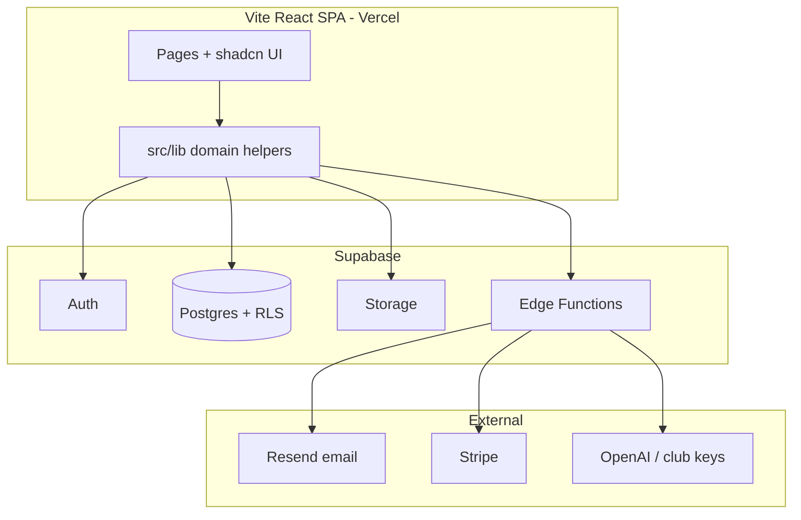

# ONE4Team — Comprehensive project audit

**Audit date:** 2026-07-06 (updated for bug investigation remediation: CI/lint green, communication pagination, auth URL ops, Supabase config gate; prior: public messaging forward/share, microsite polish, Sommerfest mobile refinements)  
**Scope:** Codebase, architecture, UX/design, production readiness, competitive positioning, market value, and value-growth levers  
**Primary reference (existing):** [`ops/PRODUCTION_READINESS_ARTIFACTS.md`](../ops/PRODUCTION_READINESS_ARTIFACTS.md) — strict production-readiness review with risk register, readiness scores, and remediation sprints  

**Related docs:** [`PROJECT_STATUS.md`](../PROJECT_STATUS.md) · [`MEMORY_BANK.md`](../MEMORY_BANK.md) · [`ROADMAP.md`](../ROADMAP.md) · [`docs/PRODUCTION_RELEASE_CHECKLIST.md`](PRODUCTION_RELEASE_CHECKLIST.md) · [`DEPLOYMENT.md`](../DEPLOYMENT.md)

---

## 1. Executive summary

ONE4Team is a **mature-in-code, early-in-market** multi-tenant club management SaaS: Vite + React + TypeScript SPA on Supabase (Postgres RLS, Auth, Storage, Edge Functions), deployed via Vercel. The product spans **internal club ops** (members, teams, schedule, matches, finances, communication, tasks), **external club presence** (configurable public microsites, join flows, tournaments, RSVP), and **partner/supplier portal** (marketplace listings, Partner Page, partner messages/tasks/reports, AI 4 T at `/partner-ai`).

| Dimension | Assessment | Score (1–100) |
|-----------|------------|:-------------:|
| **Feature breadth** | Above typical regional club apps; AI agent + public site builder are differentiators | **82** |
| **Code & architecture** | Strong foundations; some god-components and i18n monoliths need refactor | **68** |
| **UX & design** | Distinctive glass/iOS-style UI; DE market fit; occasional complexity on admin surfaces | **74** |
| **Production readiness** | Conditionally ready for controlled rollout (aligns with ops audit **61** overall) | **61** |
| **Test & quality gates** | CI guardrails, RLS integration tests, k6 scripts; **309 unit tests + ESLint `--max-warnings 0` green (2026-07-06)**; optional RLS workflow | **62** |
| **Commercial readiness** | Billing/shop wired; invite email pipeline new; domain/DNS ops still operator-heavy | **55** |

**Bottom line:** The platform is **technically credible for pilot clubs** (e.g. TSV Allach 09) and **not yet optimized for unmanaged scale** (10k+ concurrent users, full observability, mobile native). Strategic value is in **German amateur-sports depth + AI-assisted ops + club-branded public web**, not in being a generic team chat app.

---

## 2. Existing audit artifacts (use these first)

| Document | Purpose |
|----------|---------|
| **[`ops/PRODUCTION_READINESS_ARTIFACTS.md`](../ops/PRODUCTION_READINESS_ARTIFACTS.md)** | **Main technical audit** — risk register (R1–R12), readiness scores, hotspot tables, sprint remediation plan |
| [`ops/SECTION_M_GO_LIVE_CHECKLIST.md`](../ops/SECTION_M_GO_LIVE_CHECKLIST.md) | Go-live evidence rows |
| [`ops/PHASE_B_SECRETS_CHECKLIST.md`](../ops/PHASE_B_SECRETS_CHECKLIST.md) | Client vs Edge secrets |
| [`docs/PRODUCTION_RELEASE_CHECKLIST.md`](PRODUCTION_RELEASE_CHECKLIST.md) | Vercel + Supabase + Resend release steps |
| [`HOLD.md`](../HOLD.md) → **Resend domain verification** | Deferred deploy follow-up: verify domain before automatic invite emails |
| [`TASKS.md`](../TASKS.md) → **DEPLOY-EMAIL-001** | Operator checkbox for Resend + invite email smoke before go-live |
| [`PHASE0_RBAC_CHECKLIST.md`](../PHASE0_RBAC_CHECKLIST.md) | RBAC baseline |
| [`COMPLIANCE_PRIVACY_BY_DESIGN_CHECKLIST.md`](../COMPLIANCE_PRIVACY_BY_DESIGN_CHECKLIST.md) | Privacy/cookie compliance |
| [`ops/MONTHLY_COST_PERF_REVIEW.md`](../ops/MONTHLY_COST_PERF_REVIEW.md) | Cost/perf review template |
| [`docs/TSV_ALLACH_CLUB_PAGE_CHECKLIST.md`](TSV_ALLACH_CLUB_PAGE_CHECKLIST.md) | Pilot club operator checklist |

This document **extends** the ops audit with product, UX, competitive, and valuation lenses. For deployment blockers, follow **PRODUCTION_READINESS_ARTIFACTS** Sections H–M.

---

## 3. Codebase metrics (snapshot)

| Metric | Value | Notes |
|--------|------:|-------|
| TypeScript/TSX files (`src/`) | ~388 | Pages + components + lib |
| Lines of code (`src/`) | ~84,000 | Excludes tests, config, SQL |
| SQL migrations | 114 | Rich domain model; apply order critical |
| Edge Functions (deployed set) | 6+ active | co-trainer, ai4team-agent, send-club-invite-email, chat-bridge, … |
| Unit/integration test files | ~28 | Heavy on `src/lib/*`; light on pages |
| E2E specs | 5 | smoke, protected routes, nav, continuity, error boundary |
| i18n keys file (`en.ts`) | ~4,200 lines | Single large translation surface |

### Largest files (maintainability hotspots)

| File | ~Lines | Risk |
|------|-------:|------|
| `src/pages/Members.tsx` | **5,038** | God page — invites, drafts, bulk import, search, team assignment, audit |
| `src/i18n/en.ts` / `de.ts` | **4,200+** each | Translation monolith; merge conflict prone |
| `src/pages/Communication.tsx` | **2,250** | Realtime, attachments, bridge, pagination |
| `src/pages/ClubPageAdmin.tsx` | **1,495** | Public site CMS complexity |

**Recommendation:** Split `Members.tsx` into feature modules (`members/drafts`, `members/invites`, `members/bulk-import`) and colocate i18n by domain (`i18n/members.ts`, etc.) before adding more member features.

---

## 4. Code structure & architecture

### Strengths

- **Clear stack:** Vite SPA + Supabase BaaS — fast iteration, no custom backend server to operate.
- **Security model:** RLS-first multi-tenancy; Edge Functions for privileged ops (Stripe, LLM, invite email); `can_review_club_join_requests`, `is_club_admin` RPCs.
- **Shared lib layer:** Domain logic extracted to `src/lib/*` with targeted tests (imports, Sommerfest, attendance, AI agent, public club).
- **Ops maturity:** CI (`guardrails`, `budget:bundle`, `audit:phase0`), k6 load scripts, runbooks under `ops/runbooks/`.
- **Lazy routes:** `App.tsx` code-splits heavy pages; public club routes isolated under `/club/:slug/*`.
- **Plan gating:** `PlanGate`, `club_feature_trials`, Stripe checkout — monetization path exists.

### Weaknesses

- **Page-level god components** — business logic, Supabase calls, and UI intertwined in 2k–5k line files.
- **Client-side role gates** (`RequireAdmin`, `RequireTrainer`) are UX-only; must always rely on RLS (documented in ops audit R2).
- **Inconsistent error UX** — `supabase-error-message.ts` started but not universal; invite flow now has Resend/CORS-specific toasts.
- **Generated types drift** — large `types.ts`; migrations outpace local regen in some envs.
- **Pilot-specific code in core** — TSV Allach/Sommerfest helpers live in `src/lib/tsv-allach-*`; acceptable for pilot, should stay behind feature flags or club slug checks long term.

### Architecture diagram (simplified)

---

## 5. Design & UX audit

### Visual identity

- **Glass / iOS-inspired dashboard** with animated football field — distinctive vs utilitarian competitors (Spond, SportMember).
- **Club theming on public pages** — `club-theme-provider`, hero overlays, accent CTAs; light-brand contrast fixes applied.
- **Consistent component system** — shadcn/Radix, Lucide icons (emoji largely removed from dashboard chrome).
- **Bilingual DE/EN** — strong for DACH market; browser detection + manual toggle.

### UX strengths

- **Role-based dashboard** — admin sees finances/setup; trainer/player see sports widgets (`dashboard-section-visibility.ts`).
- **Public club microsite** — mobile header, team filter (`?team=`), RSVP on schedule/matches, Messages hub (**Open Messages**), embedded Communication with forward-to-WhatsApp, readable composer, **accurate pagination footer** (2026-07-06), Sommerfest live board with team logos/goals KPI/mobile live bar, mobile hero club logo + pulse (2026-07-05).
- **AI 4 T Agent** — contextual entry from Members/Teams/Activities; propose → confirm → execute reduces admin busywork.
- **Member ops** — Excel/CSV import, draft → invite workflow, club card PNG export, team assignment from members and teams.
- **Cookie consent** — GDPR-oriented preference centre (v2 schema in localStorage).

### UX gaps & friction

| Area | Issue | Impact |
|------|--------|--------|
| **Members page** | Very dense; many modes (roster, drafts, invites, bulk) in one surface | Steep learning curve for volunteer admins |
| **Invite flow** | Was manual link-only; email now via Resend but requires DNS/domain ops | Operators need clear docs (see production checklist) |
| **Onboarding** | Multi-path (create club, redeem invite, join request) | Good power, needs guided first-run for new clubs |
| **Mobile admin** | Improved scroll/tap targets; some tables still heavy on phone | Trainers often on mobile |
| **Error messages** | Mix of EN technical strings (Edge Function) and DE product copy | Trust erosion when Resend/CORS fail |
| **No native app** | PWA-friendly public site; dashboard is responsive web only | Competitors offer iOS/Android apps |

### UX priority fixes

1. **Wizard for “add first 10 members”** — draft → invite → email sent status per row.
2. **Settings health dashboard** — Supabase, Resend, Stripe, Edge Functions status in one admin panel.
3. **Empty states** — more guided CTAs on Teams, Communication, Tasks for new clubs.
4. **Split Members UI** — tabs or sub-routes: Roster | Drafts | Invites | Import.

---

## 6. Feature map vs typical club SaaS

| Capability | ONE4Team | Spond / TeamSnap | SportMember (DE) | CoachBetter |
|------------|:--------:|:----------------:|:----------------:|:-----------:|
| Member roster & roles | ✅ Strong | ✅ | ✅ | ◐ |
| Schedule & RSVP | ✅ + team overview | ✅ | ✅ | ✅ |
| Match management | ✅ + AI analysis | ◐ | ✅ | ✅ |
| Payments / dues | ✅ Packages + payment lines (`/payments`); legacy `/dues`; Stripe club billing | ✅ | ✅ | ◐ |
| Club shop | ✅ | ◐ | ◐ | ✗ |
| Public club website | ✅ **Builder** | ◐ | ◐ | ✗ |
| In-app messaging | ✅ + bridge beta | ✅ | ✅ | ◐ |
| AI assistant / agent | ✅ **Differentiator** | ✗ / minimal | ✗ | ◐ |
| Financial P&L report | ✅ | ◐ | ✅ | ✗ |
| German Mitgliederliste import | ✅ **Differentiator** | ✗ | ✅ | ✗ |
| Native mobile app | ✗ (web) | ✅ | ✅ | ✅ |
| Federation integrations (DFB, etc.) | ✗ | ◐ | ◐ | ✅ |

**Positioning:** ONE4Team is closest to **“SportMember + modern UX + public site builder + AI ops layer”** for German amateur football, not a pure messaging app.

---

## 7. Production & security (summary from ops audit)

Scores reproduced from [`ops/PRODUCTION_READINESS_ARTIFACTS.md`](../ops/PRODUCTION_READINESS_ARTIFACTS.md) Section B (March 2026 baseline; still largely valid):

| Area | Score |
|------|------:|
| Deployment readiness | 64 |
| Scalability readiness | 58 |
| Security readiness | 66 |
| Observability readiness | 48 |
| Tenant isolation readiness | 74 |
| **Overall** | **61** |

### Recent additions (June 2026 — update ops audit when convenient)

- **`send-club-invite-email`** Edge Function + Resend integration
- CORS localhost allowance when `EDGE_ALLOWED_ORIGINS` is set
- Member invite link modal on first send
- Repair migrations for RPC and avatar bucket

### Top open risks (from R1–R12)

1. **RLS policy drift** across environments — run `npm test` with JWT env + policy drift script.
2. **Observability not wired** — Sentry/Supabase dashboards/paging still checklist items (Section L).
3. **Realtime chat at scale** — Communication.tsx optimized but unproven at 500+ concurrent.
4. **Resend/domain ops** — product depends on operator verifying sending domain.
5. **God components** — increase bug rate and slow onboarding of new developers.

---

## 8. Market value assessment

> **Disclaimer:** Valuations below are **indicative frameworks**, not formal appraisals. Actual value depends on revenue, churn, team, IP ownership, and buyer/strategic context.

### Replacement cost (what it would cost to rebuild)

| Factor | Estimate |
|--------|----------|
| ~84k LOC production TS + 114 migrations + Edge Functions | **12–24 person-months** |
| At €80–120k fully loaded dev cost / year equivalent | **~€250k–€600k** replacement cost |
| Plus design, QA, ops docs, pilot iteration (TSV Allach) | **+€50k–€150k** |

### Commercial value drivers (what increases price)

| Driver | Current state | Value impact |
|--------|---------------|--------------|
| **Paying clubs (ARR)** | Stripe wired; pilot/trial heavy | Primary SaaS multiple (3–8× ARR early stage) |
| **Logo retention** | TSV Allach pilot depth | Reference case for DACH sales |
| **AI 4 T differentiation** | Agent + scope guardrails | Premium tier justification (+€20–50/club/mo) |
| **Public microsite** | Full CMS + join + tournament | Replaces WordPress + separate app |
| **Data moat** | Member master records, attendance, finances | Switching cost once adopted |
| **Technical debt** | Large page files, ops gaps | Discounts valuation 15–30% |

### Illustrative scenarios (not predictions)

| Scenario | Assumption | Indicative platform value |
|----------|------------|---------------------------|
| **Asset sale (pre-revenue)** | Code + docs + pilot, no ARR | **€150k–€400k** to a strategic buyer (software agency, sports federation vendor) |
| **Early SaaS** | 20 clubs × €79/mo ≈ **€19k ARR** | **€60k–€150k** (3–8× ARR) + asset premium |
| **Growth SaaS** | 200 clubs × €99/mo ≈ **€240k ARR** | **€1M–€2.5M** range typical for niche B2B at early growth |
| **Strategic acquisition** | AI + public site + DE member data workflows | Premium vs pure ARR if buyer is SportMember/Spond-class |

### Comparable market context (2025–2026)

- **Spond** — Nordic leader, millions of users; team communication + payments; valued far above early-stage (not direct comp for pre-scale ONE4Team).
- **SportMember** — Established in Denmark/Germany; membership + payments; less AI/public-site focus.
- **TeamSnap / LeagueApps** — US-centric; strong registration and scheduling.
- **CoachBetter** — Coaching content + planning; overlaps on training, not club admin breadth.

ONE4Team wins on **integrated story**: admin dashboard + public club face + AI agent + German registry import in one product.

---

## 9. How to increase platform value (prioritized)

### Tier 1 — Revenue & retention (0–6 months)

| Action | Effort | Value lever |
|--------|--------|-------------|
| **Close production go-live** — Vercel prod, Resend verified domain, full checklist | Low (ops) | Unblocks paid pilots |
| **Convert TSV Allach to paying reference** — case study, testimonial | Low | Sales asset |
| **Pricing page → live Stripe** — Kickoff/Squad/Pro tiers | Medium | ARR |
| **Onboarding wizard** — first club, first team, first 5 members | Medium | Activation ↑ churn ↓ |
| **Invite email reliability** — monitor Resend bounces, admin delivery status | Low | Trust |

### Tier 2 — Product differentiation (6–12 months)

| Action | Effort | Value lever |
|--------|--------|-------------|
| **AI 4 T outcomes metrics** — complete AI4T-PILOT-001–005 success metrics | Medium | Premium tier proof |
| **WhatsApp bridge production** — finish Meta webhook verify (BRIDGE-WA-001) | High | Matches Spond expectation in EU |
| **Mobile PWA install prompts** — public club + dashboard shortcuts | Medium | Perceived “app” |
| **Federation-friendly exports** — DFB-style reports, Mitgliederliste v2 | Medium | DE market lock-in |
| **White-label domains** — `club.example.de` on Vercel | High | Enterprise pricing |

### Tier 3 — Scale & enterprise (12+ months)

| Action | Effort | Value lever |
|--------|--------|-------------|
| **Observability stack live** — Sentry, Supabase alerts, Section L complete | Medium | Risk ↓ for investors |
| **Refactor god pages** — Members, Communication | High | Velocity ↑ bugs ↓ |
| **Materialized analytics** — dashboard precompute | Medium | Cost ↓ at scale |
| **Multi-sport templates** — beyond football-first | High | TAM expansion |
| **Native app shell** — Capacitor/React Native for push | Very high | Parity with Spond |

---

## 10. Recommended audit cadence

| Frequency | Activity | Owner |
|-----------|----------|-------|
| **Each release** | [`docs/PRODUCTION_RELEASE_CHECKLIST.md`](PRODUCTION_RELEASE_CHECKLIST.md) | Operator |
| **Monthly** | [`ops/MONTHLY_COST_PERF_REVIEW.md`](../ops/MONTHLY_COST_PERF_REVIEW.md) | Engineering |
| **Quarterly** | Re-score Section B in PRODUCTION_READINESS_ARTIFACTS | Tech lead |
| **Pilot milestones** | TSV Allach checklist + AI4T pilot metrics | Product |
| **Pre-fundraising / sale** | Update this document + ARR evidence | Founder |

---

## 11. Audit sign-off

| Reviewer | Role | Date | Notes |
|----------|------|------|-------|
| | Product | | |
| | Engineering | | |
| | Operations | | |

**Next update trigger:** Production launch on custom domain, first 10 paying clubs, or major refactor of Members/Communication modules.
