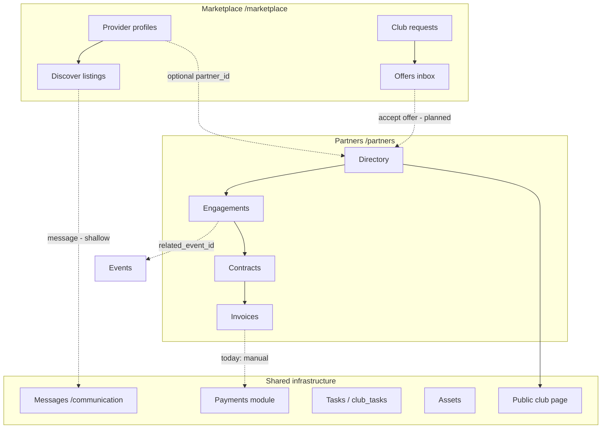

# Marketplace — implementation plan

**Date:** 2026-07-01  
**Status:** Phase 1 shipped (separate nav, routes, RBAC, tab IA); Phase 2–4 pending  
**Related:** [`marketplace-product-structure.md`](./marketplace-product-structure.md) · [`rbac-dashboard-plan.md`](./rbac-dashboard-plan.md) · [`src/lib/marketplace-product-structure.ts`](../src/lib/marketplace-product-structure.ts)

---

## 1. Product intent (do not regress)

| Module | Route | Purpose |
|--------|-------|---------|
| **Marketplace** | `/marketplace` | Cross-club discovery and procurement — where clubs and external providers meet |
| **Partners** | `/partners` | Club-internal CRM for **active** relationships already in progress |

**Marketplace** — discover providers, browse listings, search suppliers/sponsors/consultants, create club requests, receive offers, manage provider marketplace profiles.

**Partners** — active partnerships, existing sponsors, accepted suppliers, service jobs, consulting projects, contracts, ongoing relationship management.

**Rules for future work:**

- Keep **Marketplace** as its own sidebar item (above **Partners**).
- Do **not** merge Marketplace back into Partners.
- Reuse existing tables and workflows; do not duplicate partner CRM inside Marketplace.

---

## 2. Current state (as of 2026-07-01)

### 2.1 Navigation & routes

| Item | Implementation |
|------|----------------|
| Sidebar | `marketplace` module in `SIDEBAR_MENU_PROFILES`, **above** `partners`; violet label styling in `DashboardSidebar.tsx` |
| Routes | `/marketplace` → `pages/Marketplace.tsx`; `/partners` → `pages/Partners.tsx` |
| Guards | `RequireModule module="marketplace"` / `module="partners"`; both use `PlanGate feature="partners"` |
| Active nav | `pathnameToNavId` maps `/marketplace` → `marketplace`, `/partners` → `partners` |

### 2.2 RBAC (`src/lib/rbac-config.ts`)

| Role | `marketplace` | `partners` | Sidebar |
|------|---------------|------------|---------|
| `admin`, `club_admin` | `full` | `full` | Both |
| `sponsor`, `supplier`, `service_provider`, `consultant` | `own` | `none` | Marketplace only |
| `trainer`, `team_staff`, `player`, `parent_supporter`, `member` | `none` | `none` | Neither |

Access helpers live in `src/lib/marketplace-access.ts`:

- `marketplacePageExperience()` → `club_marketplace` \| `provider_portal` \| `denied`
- `canManageClubMarketplace()` → club admins (create requests, full tabs)
- `canAccessPartnersModule()` → club admins only (CRM route)

**Gap:** `permissions.ts` maps both `marketplace` and `partners` modules to legacy `partners:read` / `partners:write`. Top-bar gates use those strings; consider distinct `marketplace:*` permissions later.

### 2.3 Page responsibilities

```
/marketplace (Marketplace.tsx)
├── club_marketplace → ClubMarketplaceHub
└── provider_portal  → ProviderMarketplacePortal

/partners (Partners.tsx)
└── ClubPartnersWorkflow (full-page CRM)
```

| File | Role |
|------|------|
| `src/pages/Marketplace.tsx` | Experience router (club hub vs provider portal) |
| `src/pages/Partners.tsx` | Partners CRM gate → `ClubPartnersWorkflow` |
| `src/components/marketplace/club-marketplace-hub.tsx` | Club procurement UI (`?view=` tabs) |
| `src/components/marketplace/provider-marketplace-portal.tsx` | External provider UI (`?view=` tabs) |
| `src/pages/club-partners-workflow.tsx` | Directory, engagements, contracts, invoices (`?tab=`) |
| `src/components/marketplace/marketplace-create-request-dialog.tsx` | Create/publish club requests |
| `src/components/marketplace/marketplace-club-hero.tsx` | Overview hero + CTAs (incl. link to `/partners`) |
| `src/components/marketplace/marketplace-provider-card.tsx` | Discover listing card |
| `src/components/marketplace/marketplace-empty-state.tsx` | Shared empty states |

`club-partners-workflow.tsx` still supports an `embedded` prop (sub-nav inside another shell). It is **unused** after Marketplace/Partners split; safe to keep for future nesting or remove in a cleanup pass.

### 2.4 Data layer

**Marketplace tables** (migration `20260731170000_marketplace_provider_portal_apply.sql`):

| Table | Purpose |
|-------|---------|
| `marketplace_provider_profiles` | Global provider listings; optional `partner_id` → `partners` |
| `marketplace_requests` | Club procurement requests |
| `marketplace_offers` | Provider proposals per request |
| `marketplace_saved_providers` | Club bookmarks |

**Partners tables** (existing):

| Table | Purpose |
|-------|---------|
| `partners` | Club-scoped partner directory |
| `partner_tasks` | Engagements (+ categories, event link via `20260731120000`) |
| `partner_contracts` | Agreements |
| `partner_invoices` | Club partner invoice ledger |

**Hooks:**

| Hook | Scope |
|------|-------|
| `use-marketplace.ts` | Profiles, club marketplace load, `createMarketplaceRequest` |
| `use-partner-workflows.ts` | Partners, contracts, invoices, tasks, events |

Schema readiness: hooks set `schemaReady: false` when tables are missing; UI shows migration hint.

### 2.5 i18n

- `sidebar.marketplace`, `sidebar.partners` (EN/DE)
- `marketplacePage.*` — club + provider copy, categories, request dialog, hero
- `partnersPage.*` — CRM copy, engagement categories, contract/invoice statuses

---

## 3. Implemented vs placeholder

### 3.1 Marketplace — implemented

| Area | Status |
|------|--------|
| Separate sidebar + route | Done |
| RBAC module + experience routing | Done |
| Club: overview hero, KPIs, tab bar | Done |
| Club: discover (search, filters, provider cards) | Done |
| Club: create/publish requests (dialog + insert) | Done |
| Club: list requests & offers | Read-only lists |
| Provider: profile create/edit/submit for review | Done |
| Provider: browse open marketplace requests | Read-only |
| RLS + migrations | Applied (`20260731170000`) |

### 3.2 Marketplace — placeholder or partial

| Tab / feature | Current behavior |
|---------------|------------------|
| Documents | `MarketplaceEmptyState` (“coming soon”) |
| Payments (club) | Empty state; CTA → `/partners?tab=invoices` |
| Reviews | Empty state |
| Provider: send offer | Button present; **no create handler** |
| Provider: offers, jobs, deliverables | Empty / scaffold |
| Provider: placement | Links to `/club-page-admin` |
| Provider: payments | Redirect to `/payments` (different model) |
| Save provider | `isSaved` display only; **no toggle/insert** |
| Provider card: View profile, Request offer | Props exist; **not wired** in hub |
| Message provider | Navigates to `/communication` (no thread context) |
| Listing moderation | DB fields (`verification_status`, `is_featured`); **no admin UI** |
| Accept offer → Partners | **Not built** |
| `partner_id` on marketplace profile | Column exists; **not linked in UI** |

### 3.3 Partners — implemented

| Area | Status |
|------|--------|
| Partner directory CRUD | Done |
| Engagements (`partner_tasks`) | Done (+ event link) |
| Contracts & invoices CRUD | Done |
| Overview lanes | Done |
| Public club page visibility toggle | Done |
| Legacy schema fallback in hook | Done |

### 3.4 Partners — gaps

| Issue | Notes |
|-------|-------|
| `canManagePartners = perms.isTrainer` | Trainers cannot reach route; dead code |
| No link from Partners → Marketplace | One-way hero CTA only |
| `partner_invoices` ≠ `/payments` module | Separate ledgers |

---

## 4. Relationship diagram



**Mental model:** Marketplace is the **funnel** (discover → request → offer). Partners is the **CRM** (relationship → contract → delivery → invoice).

---

## 5. Existing reusable components & patterns

Reuse these; do not rebuild:

| Pattern | Location | Use in Marketplace |
|---------|----------|-------------------|
| Dashboard shell | `DASHBOARD_PAGE_ROOT`, `DashboardHeaderSlot` | All marketplace pages |
| Panel styling | `PARTNER_PANEL_CLASS`, `partner-workflow-ui.ts` | Cards, KPIs, badges |
| Empty states | `marketplace-empty-state.tsx` | Tabs without data |
| Dialogs | shadcn `Dialog` + `marketplace-create-request-dialog.tsx` | Offer dialog (mirror pattern) |
| RBAC guards | `RequireModule`, `canAccessModule` | New sub-routes |
| Dynamic Supabase | `supabaseDynamic` | Tables ahead of generated types |
| Partner CRM | `club-partners-workflow.tsx` | **Do not duplicate** — link or accept-offer bridge |
| Engagement model | `partner-workflow-models.ts` | Map accepted offers → engagement |
| i18n structure | `marketplacePage` / `partnersPage` | Extend, don’t fork |

---

## 6. Marketplace page structure (target)

### 6.1 Club admin (`ClubMarketplaceHub`)

| Tab (`?view=`) | Target state |
|----------------|--------------|
| `overview` | Hero, KPIs, featured providers, recent requests, CTA to Partners |
| `discover` | Search/filter, saved providers, provider detail drawer |
| `requests` | List + create/edit/publish/close requests |
| `offers` | List offers per request; accept/reject → Partners bridge |
| `documents` | Link to Assets or partner_documents (TBD) |
| `payments` | Summary + deep link to Partners invoices **or** shared payment refs |
| `reviews` | Post-engagement ratings (new table TBD) |

### 6.2 External provider (`ProviderMarketplacePortal`)

| Tab | Target state |
|-----|--------------|
| `overview` | Listing status, completeness, open requests count |
| `profile` / `services` / `packages` | Profile CRUD (mostly done) |
| `placement` | Sponsor public placement preview (club page) |
| `requests` | Filtered open requests matching categories |
| `offers` | Create/send/edit offers on requests |
| `jobs` / `deliverables` | Linked to accepted offers → `partner_tasks` (read-only portal view) |
| `payments` | Provider-facing payment status (integrate with `/payments` or invoices) |
| `documents` | Deliverables / contracts (Assets or storage bucket) |
| `reviews` | Received reviews |
| `settings` | Notification prefs, listing visibility |

---

## 7. Missing data models

| Model | Priority | Notes |
|-------|----------|-------|
| Offer create/update API | **P0** | Table exists; need insert + status transitions |
| Saved provider toggle | **P1** | Table exists; need hook + UI |
| Offer acceptance record | **P1** | `accepted` status + audit fields; trigger Partners bridge |
| `marketplace_provider_profiles.partner_id` workflow | **P1** | Link listing to club `partners` row on acceptance |
| Reviews / ratings | **P2** | New table or extend partner model |
| Marketplace documents | **P2** | FK to storage + `partner_id` / `offer_id` |
| Message threads context | **P2** | `communication` thread metadata: `marketplace_request_id` / `provider_profile_id` |
| Platform listing moderation queue | **P2** | Admin view for `submitted_for_review` → `active` |
| Featured / verified admin tools | **P2** | `is_featured`, `verification_status` |

No new tables required for **P0 offer flow** — `marketplace_offers` is sufficient.

---

## 8. Missing RBAC rules & guards

| Item | Status | Recommendation |
|------|--------|----------------|
| `marketplace` module in matrix | Done | — |
| `partners` limited to club admins | Done | — |
| `/marketplace` `RequireModule` | Done | — |
| `/partners` `RequireModule` | Done | — |
| Distinct legacy permissions | Missing | Add `marketplace:read` / `marketplace:write` in `permissions.ts` |
| Platform admin moderation | Missing | `canModerateMarketplaceListings` exists but unused; wire to admin role |
| `DashboardTopBar` / `AppHeader` | Partial | Marketplace + Partners gates use `partners:read`/`write`; align with `useDashboardNav` |
| RLS integration tests | Missing | Extend `src/test/rls.integration.test.ts` |
| E2E smoke | Missing | Sponsor: `/marketplace` OK, `/members` blocked |

**Internal cleanup (low risk):**

- Remove or fix `canManagePartners = perms.isTrainer` in `club-partners-workflow.tsx`
- Remove unused `embedded` mode or document if keeping for embed scenarios

---

## 9. Integration with other modules

| Module | Today | Recommended |
|--------|-------|-------------|
| **Messages** | Generic `/communication` navigation | Pass `provider_profile_id` / request id; optional thread type `marketplace` |
| **Tasks** | `club_tasks.partner_id` separate from `partner_tasks` | On offer accept → optional `partner_tasks` engagement; don’t merge into `club_tasks` without design |
| **Payments** | Club `/payments` ≠ `partner_invoices` | Partners invoices stay CRM; Marketplace payments tab shows **partner invoice summary** or Stripe links when available |
| **Assets** | Independent | Documents tab → attach files to request/offer/contract |
| **Events** | `partner_tasks.related_event_id` | Club request `deadline` / event sponsorship → link on acceptance |
| **Club page** | `partners.show_on_public_club_page` + provider `placement` tab | Keep public exposure separate from dashboard RBAC |
| **Shop** | Club shop | No direct link; suppliers may list shop services in marketplace categories |

---

## 10. Recommended implementation order

### Phase 2 — Core marketplace loop (P0)

1. **Provider offer create** — dialog + `createMarketplaceOffer()` in `use-marketplace.ts`; wire “Send offer” in provider portal.
2. **Club offer inbox** — status badges, detail view, accept/reject actions.
3. **Save provider** — toggle `marketplace_saved_providers` from discover cards.
4. **Provider card actions** — view profile drawer; “Request quote” pre-fills club request.

### Phase 3 — Marketplace → Partners bridge (P1)

5. **Accept offer** — update offer + request status; create/update `partners` row; optional `partner_contracts` draft; set `marketplace_provider_profiles.partner_id`.
6. **Partners entry point** — badge on Partners overview: “From marketplace” engagements.
7. **Payments tab** — read-only aggregate from `partner_invoices` for marketplace-originated partners.

### Phase 4 — Trust & operations (P2)

8. **Listing moderation** — club/platform admin queue for `submitted_for_review`.
9. **Verification & featured** — admin tools + discover filters (UI partially exists).
10. **Documents & reviews** — schema + UI or defer with clear “coming soon” copy.

### Phase 5 — Hardening (P2)

11. **RLS integration tests** for marketplace tables.
12. **E2E smoke** per role (external vs club admin vs trainer).
13. **RBAC cleanup** — distinct permissions, top bar via `useDashboardNav`, remove dead trainer checks.
14. **Update** [`rbac-dashboard-plan.md`](./rbac-dashboard-plan.md) §10 checklist as items ship.

---

## 11. Definition of done (this document)

- [x] Existing Marketplace and Partners structures analyzed
- [x] Marketplace remains a separate sidebar item
- [x] Partners remains available for active relationships (club admins)
- [x] Clear implementation plan with phases, gaps, and reuse map
- [x] Phase 1 partner portal shipped in repo (routes, Partner Page, `/partner-ai`, persona switch) — see **`TASKS.md` PARTNER-***
- [ ] Phase 2+ marketplace loop items tracked in **`TASKS.md`** PARTNER-OPS-002

---

## 12. File index (quick reference)

| Concern | Path |
|---------|------|
| RBAC matrix | `src/lib/rbac-config.ts` |
| Marketplace access | `src/lib/marketplace-access.ts` |
| Types | `src/lib/marketplace-models.ts`, `src/lib/partner-workflow-models.ts` |
| Routes | `src/App.tsx` |
| Pages | `src/pages/Marketplace.tsx`, `src/pages/Partners.tsx` |
| Club UI | `src/components/marketplace/club-marketplace-hub.tsx` |
| Provider UI | `src/components/marketplace/provider-marketplace-portal.tsx` |
| Partners CRM | `src/pages/club-partners-workflow.tsx` |
| Hooks | `src/hooks/use-marketplace.ts`, `src/hooks/use-partner-workflows.ts` |
| Nav | `src/lib/dashboard-nav.ts`, `src/hooks/use-dashboard-nav.ts`, `src/components/dashboard/DashboardSidebar.tsx` |
| Migration | `supabase/migrations/20260731170000_marketplace_provider_portal_apply.sql` |
| Tests | `src/lib/rbac-config.test.ts`, `src/lib/marketplace-access.test.ts` |
