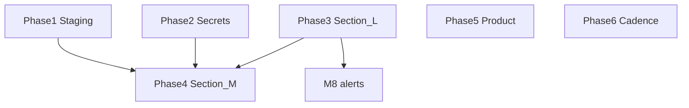

# Production readiness — completion plan (open topics)

This document turns the **remaining** items from [`PRODUCTION_READINESS_ARTIFACTS.md`](PRODUCTION_READINESS_ARTIFACTS.md) into an ordered execution plan. It does **not** duplicate work already marked complete in the artifact’s **Execution progress** block (ST-006–ST-012 code in repo).

**Evidence surfaces:** [`SECTION_M_GO_LIVE_CHECKLIST.md`](SECTION_M_GO_LIVE_CHECKLIST.md), [`PHASE_C_SECTION_L_EVIDENCE.md`](PHASE_C_SECTION_L_EVIDENCE.md), [`PHASE_A_STAGING_RUNBOOK.md`](PHASE_A_STAGING_RUNBOOK.md), [`PHASE_B_SECRETS_CHECKLIST.md`](PHASE_B_SECRETS_CHECKLIST.md).

---

## Scope boundary

| Already complete (git) | Still open |
|------------------------|------------|
| Execution progress in the artifact: RPCs, indexes, CI, runbooks scaffold, report-only CSP, Health/Communication helpers, optional `health` Edge **source**, phased runbooks | **Verification** on your Supabase projects, **Section L** vendor configuration, **Section M** evidence rows, **game-day MTTR**, **monthly cost/perf cadence**, **CSP enforcement**, **broader degraded UX** |

---

## Phase 1 — Staging: DB + proof + load

**Goal:** Close **Open — verification** in the artifact and supply evidence for Section **M4, M5, M7** on the staging path.

| Step | Action | Reference |
|------|--------|-----------|
| 1.1 | Apply migrations **32–42** on **staging** (full files; entire `20260329132000_hotspot_composite_indexes.sql`). | [`MEMORY_BANK.md`](../MEMORY_BANK.md), [`DEPLOYMENT.md`](../DEPLOYMENT.md) |
| 1.2 | Run RLS JWT tests with `RLS_TEST_*` against staging. | [`src/test/rls.integration.test.ts`](../src/test/rls.integration.test.ts), Phase A **A2** |
| 1.3 | Optional: `ops/pg_policies.snapshot.txt` + `PG_POLICIES_SNAPSHOT_FILE=... npm run policies:drift`. | [`PG_POLICIES_SNAPSHOT.md`](PG_POLICIES_SNAPSHOT.md) |
| 1.4 | EXPLAIN snapshots for hotspot queries (artifact index verification / EXPLAIN template). | [`EXPLAIN_EVIDENCE_TEMPLATE.md`](EXPLAIN_EVIDENCE_TEMPLATE.md) |
| 1.5 | k6: `npm run k6:smoke`, `npm run k6:journeys`, `npm run k6:staged-reads` against **staging** URLs. | [`PHASE_A_STAGING_RUNBOOK.md`](PHASE_A_STAGING_RUNBOOK.md) **A5** |
| 1.6 | ~500-session realtime lab soak. | [`REALTIME_SOAK_LOG.md`](REALTIME_SOAK_LOG.md), [`runbooks/realtime-incident.md`](runbooks/realtime-incident.md) **A6** |

**Done when:** Evidence links or attachments filed (tickets or [`SECTION_M_GO_LIVE_CHECKLIST.md`](SECTION_M_GO_LIVE_CHECKLIST.md)); staging migration order matches repo.

---

## Phase 2 — Secrets and client bundle (Section M 1–3)

**Goal:** Complete [`PHASE_B_SECRETS_CHECKLIST.md`](PHASE_B_SECRETS_CHECKLIST.md) and tick Section **M rows 1–3**.

| Step | Action |
|------|--------|
| 2.1 | Vercel/host: only `VITE_SUPABASE_URL` + publishable key in client (plus safe app vars). |
| 2.2 | Supabase Edge secrets: service role, Stripe, LLM as needed; redeploy affected functions. |
| 2.3 | Set **`EDGE_ALLOWED_ORIGINS`** to explicit staging + production origins (no `*` in prod). |

**Done when:** B1–B3 signed with redacted screenshots or internal notes; SECTION_M rows 1–3 marked done with evidence.

---

## Phase 3 — Section L (monitoring and alerting)

**Goal:** Check every row in [PRODUCTION_READINESS_ARTIFACTS.md](PRODUCTION_READINESS_ARTIFACTS.md) Section L (lines 328–335) and fill [`PHASE_C_SECTION_L_EVIDENCE.md`](PHASE_C_SECTION_L_EVIDENCE.md). **Section M row 8 depends on this.**

Suggested order:

1. **Sentry** — error + release health alerts.
2. **Supabase** — DB (CPU, connections, locks, latency) + API (4xx/5xx, p95).
3. **Edge Functions** — invocations, duration, failures by function.
4. **Stripe** — webhook failures / retry backlog (see [`runbooks/stripe-webhook-backlog.md`](runbooks/stripe-webhook-backlog.md)).
5. **Realtime** — connection / throughput vs **Observability thresholds** in the main artifact.
6. **Tenant isolation** — cadence for RLS tests + optional policy drift.
7. **Business KPIs** — minimal definitions (checkout, messages, active clubs, DAU) in your analytics tool or manual query.

**Pager:** Route P1/P2 to on-call (PagerDuty, Opsgenie, email).

**Done when:** Section L checkboxes in the artifact are `[x]` with links in PHASE_C.

---

## Phase 4 — Section M (go-live rows 4–10)

**Goal:** Complete [`SECTION_M_GO_LIVE_CHECKLIST.md`](SECTION_M_GO_LIVE_CHECKLIST.md) with evidence.

| Row | Dependency | Action |
|-----|------------|--------|
| M4 | Phase 1 + decision | Apply same migration chain to **production**; verify schema vs repo. |
| M5 | Phase 1 | RLS integration tests (or equivalent) against **production** target. |
| M6 | CI | Production build: `npm run guardrails`; no dev bypass in Vercel production env. |
| M7 | Phase 1.5 | k6 / SLO evidence (prod or prod-like per risk policy). |
| M8 | Phase 3 | Dashboards and paging alerts active. |
| M9 | Section N | Rollback rehearsal with owner; document steps. |
| M10 | Post-deploy | Smoke: auth, members, communication, settings, club admin, shop as applicable. |

**Done when:** All 10 rows have Done + evidence; sign-off line completed.

---

## Phase 5 — Product / engineering (artifact “Open — product/engineering”)

**Goal:** Close remaining items in [`WAVE3_ROADMAP.md`](WAVE3_ROADMAP.md) and the artifact open table.

| Topic | Work |
|-------|------|
| **CSP enforcement** | When Report-Only noise is acceptable: switch to enforcing `Content-Security-Policy` (e.g. in [`vercel.json`](../vercel.json)); tune `connect-src` / `script-src` from reports. Update [`CSP_ROLLOUT.md`](CSP_ROLLOUT.md). |
| **Degraded-mode UX** | Extend retry / clear errors on high-value flows (Settings, Shop, matches) using [`src/lib/supabase-error-message.ts`](../src/lib/supabase-error-message.ts) and `isTransientSupabaseMessage` where appropriate. |
| **Health depth** | `supabase functions deploy health` to staging/prod; confirm [`src/pages/Health.tsx`](../src/pages/Health.tsx) shows `edgeDatabase: ok` (not skipped). |
| **Wave 4 (optional)** | Lighthouse/RUM per [`ROUTE_PERF_BUDGETS.md`](ROUTE_PERF_BUDGETS.md); precompute dashboard tiles only if metrics require it. |
| **Abuse (optional)** | Expand rate limits on public surfaces as traffic grows. |

**Done when:** CSP enforced (or explicitly deferred with owner + date + risk note); agreed UX scope shipped; `health` deployed if required for prod SLOs.

---

## Phase 6 — Ongoing cadence

| Task | Document |
|------|----------|
| Game day: timed drills + **MTTR** | [`GAME_DAY_DRILL_LOG.md`](GAME_DAY_DRILL_LOG.md) |
| Monthly cost/perf | [`MONTHLY_COST_PERF_REVIEW.md`](MONTHLY_COST_PERF_REVIEW.md) — set **Next scheduled review** after each run |
| Task tracker | [`TASKS.md`](../TASKS.md) **PROD-DEPLOY-001** until M1–M10 are checked off |

---

## Dependency order

- Configure **Section L before M8**.
- **Phase 5** may overlap late Phase 4 once CSP reports are stable.

---

## Definition of complete

The artifact’s **open topics** are complete when:

1. **Open — verification:** Evidence exists for staging (and prod where required): migrations, RLS tests, EXPLAIN, k6, realtime soak.
2. **Open — ops wiring:** Section L checked; Section M 1–10 checked; at least one game-day row with **real MTTR** (not desk-only).
3. **Open — product/engineering:** CSP **enforced** (or **deferred in writing** with owner and date); agreed degraded UX delivered; `health` Edge deployed if you require DB depth in production.

**Optional:** Add a one-line status under **Open vs closed** in the main artifact (`staging complete YYYY-MM-DD`, `prod complete YYYY-MM-DD`) so narrative sections are not mistaken for pending work.

---

## Related

- Primary index: [`PRODUCTION_READINESS_ARTIFACTS.md`](PRODUCTION_READINESS_ARTIFACTS.md)
- Rollback: Section N in that file
- Observability thresholds: table under ST-009 in that file
